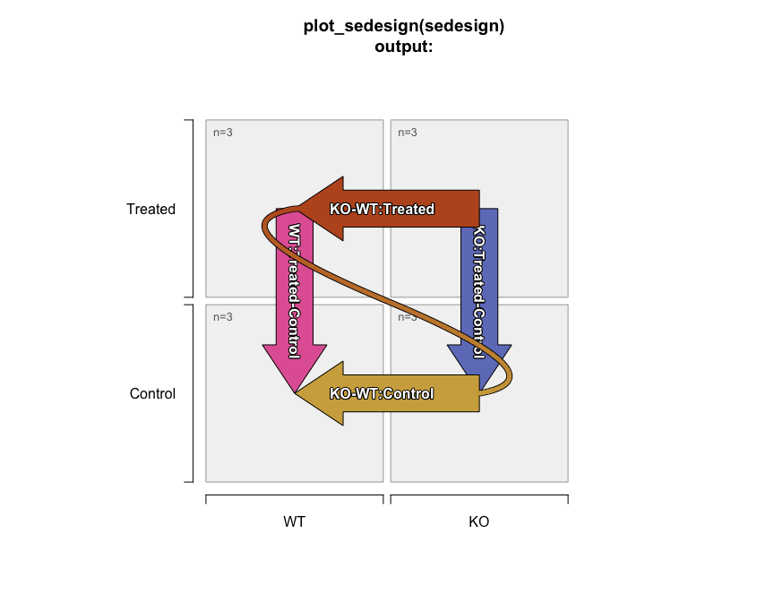

- [Jam SummarizedExperiment Stats
  (jamses)](#jam-summarizedexperiment-stats-jamses)
  - [Goals of jamses](#goals-of-jamses)
  - [Approach for Statistical
    Contrasts](#approach-for-statistical-contrasts)
  - [Design and contrasts - SEDesign](#design-and-contrasts---sedesign)
    - [SEDesign S4 Object Details](#sedesign-s4-object-details)
    - [Example SEDesign object](#example-sedesign-object)
  - [Data normalization](#data-normalization)
  - [Statistical comparisons](#statistical-comparisons)
    - [`se_contrast_stats()` is the central
      function](#se_contrast_stats-is-the-central-function)
  - [Heatmaps](#heatmaps)
  - [Future work:](#future-work)

<!-- README.md is generated from README.Rmd. Please edit that file -->

# Jam SummarizedExperiment Stats (jamses)

This package is under active development, these functions make up a core
set of methods currently used across active Omics analysis projects. A
summary of goals and relevant features are described below.

[Full jamses command reference](https://jmw86069.github.io/jamses)

## Goals of jamses

The core goal is to make data analysis and visualization of
`SummarizedExperiment` objects straightforward for common scenarios. It
also accepts `SingleCellExperiment` and `Seurat` objects.

- **Define a design matrix** using `~ 0 + group` syntax, see below.

- **Define statistical contrasts** to compare one or more factors, see
  `groups_to_sedesign()`.

- **Plot contrasts** as defined, see `plot_sedesign()`.

- **Confirm design,contrast matrices** are always in sync, see
  `SEDesign-class`.

- **Automate analysis of multiple contrasts**, using
  limma/limmavoom/DEqMS, see `se_contrast_stats()`.

- **Convenient “short hand” for contrasts**, see `contrasts2comp()`.

       (B_treated-B_control)-(A_treated-A_control)
       # "comp" format:
       B-A:treated-control

- **Integrate with other tools**.

  - `venndir::venndir()` - see Github `"jmw86069/venndir"` to create
    directional Venn diagrams.

## Approach for Statistical Contrasts

[The Limma User’s
Guide](https://www.bioconductor.org/packages/devel/bioc/vignettes/limma/inst/doc/)
(LUG) is an amazing resource which describes alternate approaches for
one-way and two-way contrasts, **which are mathematically equivalent**.
For a more thorough discussion please review these approaches to confirm
that `~0 + x` is mathematically identical to `~ x`, and only differs in
how estimates are reported.

- The approach used in `jamses` uses the `~0 + x` strategy.<br> Each
  experiment group is defined using independent replicates.<br> This
  approach *does not imply* that there is “no intercept” during the
  model fit, see LUG for details.

- One-way contrasts must compare only one factor change per
  contrast.<br> For example, a valid one-way contrast is shown below:

      (A_treated - A_control) # valid one-way contrast

  It compares **`(treated-control)`** with factor level **`A`**
  unchanged.<br> However, an invalid one-way contrast is shown below:

      (A_treated - B_control) # not a valid one-way contrast

  It is invalid because allows two factor changes: **`treated-control`**
  and **`A-B`**.

- A two-way contrast is defined as the fold change of two
  ***compatible*** one-way fold changes, and in the proper order.<br>
  Consider the following:

      (A_treated - A_control)  # one-way contrast
                               # "treated-control" for A
      (B_treated - B_control)  # compatible one-way contrast
                               # "treated-control" for B
      (B_treated - B_knockout) # incompatible one-way contrast

- Caveat: Specific contrasts can be added manually when necessary.

## Design and contrasts - SEDesign

- `groups_to_sedesign()` takes by default a `data.frame` where each
  column represents an experiment factor, and creates the following:

  - `design` matrix
  - `contrast` matrix using only appropriate changes in single
    experiment factor levels for one-way contrasts, and equivalent
    contrasts across secondary factor levels where appropriate for
    two-way contrasts, up to `max_depth` factor depth.
  - `samples` vector representing individual sample columns used from
    the input data.

- Output is `SEDesign` as an S4 object with slot names:

  - `sedesign@design` - the design matrix.
  - `sedesign@contrasts` - the contrasts matrix.
  - `sedesign@samples` - vector of samples.

### SEDesign S4 Object Details

`SEDesign` is an S4 object that contains the following slots:

- **`samples`**: a `character` vector of sample names, derived from
  `colnames()` of the SummarizedExperiment\` object.

  - When `samples` are subset, it has a cascade effect on `design` and
    `contrasts`. When groups are no longer represented, they are removed
    from `design` and `contrasts` as relevant.

- **`design`**: a `matrix` representing the design matrix, with
  additional constraints:

  - `rownames()` are always maintained, so they can be aligned with
    `colnames()` of the `SummarizedExperiment` object. This requirement
    helps ensure that the design and assay data are always in proper
    sync.
  - `colnames()` are defined as sample groups, equivalent to using
    `model.matrix( ~ 0 + groups )` for example from the [The Limma
    User’s
    Guide](https://www.bioconductor.org/packages/devel/bioc/vignettes/limma/inst/doc/)
    from the `limma` Bioconductor package.
  - All values are always `1` or `0` with no fractions. More complicated
    designs require manual adjustment, beyond the scope of `jamses`.

- **`contrasts`**: a `matrix` representing the contrast matrix used for
  statistical comparisons, with additional constraints:

  - `rownames(contrasts)` are always defined, and always equal
    `colnames(contrasts)` to ensure contrasts and design are always
    properly synchronized.

### Example SEDesign object

The example below uses a `character` vector of group names per sample,
with two factors separated by underscore `"_"`. The same data can be
provided as a `data.frame` with two columns.

``` r
library(jamses)
library(kableExtra)

igroups <- jamba::nameVector(paste(rep(c("WT", "KO"), each=6),
   rep(c("Control", "Treated"), each=3),
   sep="_"),
   suffix="_rep");
igroups <- factor(igroups, levels=unique(igroups));
# jamba::kable_coloring(color_cells=FALSE,
#    format="markdown",
#    caption="Sample to group association",
#    data.frame(groups=igroups))
knitr::kable(data.frame(groups=igroups))
```

|                 | groups     |
|:----------------|:-----------|
| WT_Control_rep1 | WT_Control |
| WT_Control_rep2 | WT_Control |
| WT_Control_rep3 | WT_Control |
| WT_Treated_rep1 | WT_Treated |
| WT_Treated_rep2 | WT_Treated |
| WT_Treated_rep3 | WT_Treated |
| KO_Control_rep1 | KO_Control |
| KO_Control_rep2 | KO_Control |
| KO_Control_rep3 | KO_Control |
| KO_Treated_rep1 | KO_Treated |
| KO_Treated_rep2 | KO_Treated |
| KO_Treated_rep3 | KO_Treated |

The resulting design and contrasts matrices are shown below:

``` r
sedesign <- groups_to_sedesign(igroups);
jamba::kable_coloring(
# knitr::kable(
   colorSub=c(`-1`="dodgerblue", `1`="firebrick"),
   caption="Design matrix output from design(sedesign).",
   data.frame(check.names=FALSE, design(sedesign)));
```

<table class="table" style="margin-left: auto; margin-right: auto;">
<caption>
Design matrix output from design(sedesign).
</caption>
<thead>
<tr>
<th style="text-align:left;">
</th>
<th style="text-align:right;">
WT_Control
</th>
<th style="text-align:right;">
WT_Treated
</th>
<th style="text-align:right;">
KO_Control
</th>
<th style="text-align:right;">
KO_Treated
</th>
</tr>
</thead>
<tbody>
<tr>
<td style="text-align:left;border-left:1px solid #DDDDDD;white-space: nowrap;">
WT_Control_rep1
</td>
<td style="text-align:right;border-left:1px solid #DDDDDD;white-space: nowrap;">
<span style="     color: rgba(255, 255, 255, 255) !important;border-radius: 4px; padding-right: 4px; padding-left: 4px; background-color: firebrick !important;">1</span>
</td>
<td style="text-align:right;border-left:1px solid #DDDDDD;white-space: nowrap;">
<span style="     color: rgba(0, 0, 0, 255) !important;border-radius: 4px; padding-right: 4px; padding-left: 4px; background-color: transparent !important;">0</span>
</td>
<td style="text-align:right;border-left:1px solid #DDDDDD;white-space: nowrap;">
<span style="     color: rgba(0, 0, 0, 255) !important;border-radius: 4px; padding-right: 4px; padding-left: 4px; background-color: transparent !important;">0</span>
</td>
<td style="text-align:right;border-left:1px solid #DDDDDD;white-space: nowrap;">
<span style="     color: rgba(0, 0, 0, 255) !important;border-radius: 4px; padding-right: 4px; padding-left: 4px; background-color: transparent !important;">0</span>
</td>
</tr>
<tr>
<td style="text-align:left;border-left:1px solid #DDDDDD;white-space: nowrap;">
WT_Control_rep2
</td>
<td style="text-align:right;border-left:1px solid #DDDDDD;white-space: nowrap;">
<span style="     color: rgba(255, 255, 255, 255) !important;border-radius: 4px; padding-right: 4px; padding-left: 4px; background-color: firebrick !important;">1</span>
</td>
<td style="text-align:right;border-left:1px solid #DDDDDD;white-space: nowrap;">
<span style="     color: rgba(0, 0, 0, 255) !important;border-radius: 4px; padding-right: 4px; padding-left: 4px; background-color: transparent !important;">0</span>
</td>
<td style="text-align:right;border-left:1px solid #DDDDDD;white-space: nowrap;">
<span style="     color: rgba(0, 0, 0, 255) !important;border-radius: 4px; padding-right: 4px; padding-left: 4px; background-color: transparent !important;">0</span>
</td>
<td style="text-align:right;border-left:1px solid #DDDDDD;white-space: nowrap;">
<span style="     color: rgba(0, 0, 0, 255) !important;border-radius: 4px; padding-right: 4px; padding-left: 4px; background-color: transparent !important;">0</span>
</td>
</tr>
<tr>
<td style="text-align:left;border-left:1px solid #DDDDDD;white-space: nowrap;">
WT_Control_rep3
</td>
<td style="text-align:right;border-left:1px solid #DDDDDD;white-space: nowrap;">
<span style="     color: rgba(255, 255, 255, 255) !important;border-radius: 4px; padding-right: 4px; padding-left: 4px; background-color: firebrick !important;">1</span>
</td>
<td style="text-align:right;border-left:1px solid #DDDDDD;white-space: nowrap;">
<span style="     color: rgba(0, 0, 0, 255) !important;border-radius: 4px; padding-right: 4px; padding-left: 4px; background-color: transparent !important;">0</span>
</td>
<td style="text-align:right;border-left:1px solid #DDDDDD;white-space: nowrap;">
<span style="     color: rgba(0, 0, 0, 255) !important;border-radius: 4px; padding-right: 4px; padding-left: 4px; background-color: transparent !important;">0</span>
</td>
<td style="text-align:right;border-left:1px solid #DDDDDD;white-space: nowrap;">
<span style="     color: rgba(0, 0, 0, 255) !important;border-radius: 4px; padding-right: 4px; padding-left: 4px; background-color: transparent !important;">0</span>
</td>
</tr>
<tr>
<td style="text-align:left;border-left:1px solid #DDDDDD;white-space: nowrap;">
WT_Treated_rep1
</td>
<td style="text-align:right;border-left:1px solid #DDDDDD;white-space: nowrap;">
<span style="     color: rgba(0, 0, 0, 255) !important;border-radius: 4px; padding-right: 4px; padding-left: 4px; background-color: transparent !important;">0</span>
</td>
<td style="text-align:right;border-left:1px solid #DDDDDD;white-space: nowrap;">
<span style="     color: rgba(255, 255, 255, 255) !important;border-radius: 4px; padding-right: 4px; padding-left: 4px; background-color: firebrick !important;">1</span>
</td>
<td style="text-align:right;border-left:1px solid #DDDDDD;white-space: nowrap;">
<span style="     color: rgba(0, 0, 0, 255) !important;border-radius: 4px; padding-right: 4px; padding-left: 4px; background-color: transparent !important;">0</span>
</td>
<td style="text-align:right;border-left:1px solid #DDDDDD;white-space: nowrap;">
<span style="     color: rgba(0, 0, 0, 255) !important;border-radius: 4px; padding-right: 4px; padding-left: 4px; background-color: transparent !important;">0</span>
</td>
</tr>
<tr>
<td style="text-align:left;border-left:1px solid #DDDDDD;white-space: nowrap;">
WT_Treated_rep2
</td>
<td style="text-align:right;border-left:1px solid #DDDDDD;white-space: nowrap;">
<span style="     color: rgba(0, 0, 0, 255) !important;border-radius: 4px; padding-right: 4px; padding-left: 4px; background-color: transparent !important;">0</span>
</td>
<td style="text-align:right;border-left:1px solid #DDDDDD;white-space: nowrap;">
<span style="     color: rgba(255, 255, 255, 255) !important;border-radius: 4px; padding-right: 4px; padding-left: 4px; background-color: firebrick !important;">1</span>
</td>
<td style="text-align:right;border-left:1px solid #DDDDDD;white-space: nowrap;">
<span style="     color: rgba(0, 0, 0, 255) !important;border-radius: 4px; padding-right: 4px; padding-left: 4px; background-color: transparent !important;">0</span>
</td>
<td style="text-align:right;border-left:1px solid #DDDDDD;white-space: nowrap;">
<span style="     color: rgba(0, 0, 0, 255) !important;border-radius: 4px; padding-right: 4px; padding-left: 4px; background-color: transparent !important;">0</span>
</td>
</tr>
<tr>
<td style="text-align:left;border-left:1px solid #DDDDDD;white-space: nowrap;">
WT_Treated_rep3
</td>
<td style="text-align:right;border-left:1px solid #DDDDDD;white-space: nowrap;">
<span style="     color: rgba(0, 0, 0, 255) !important;border-radius: 4px; padding-right: 4px; padding-left: 4px; background-color: transparent !important;">0</span>
</td>
<td style="text-align:right;border-left:1px solid #DDDDDD;white-space: nowrap;">
<span style="     color: rgba(255, 255, 255, 255) !important;border-radius: 4px; padding-right: 4px; padding-left: 4px; background-color: firebrick !important;">1</span>
</td>
<td style="text-align:right;border-left:1px solid #DDDDDD;white-space: nowrap;">
<span style="     color: rgba(0, 0, 0, 255) !important;border-radius: 4px; padding-right: 4px; padding-left: 4px; background-color: transparent !important;">0</span>
</td>
<td style="text-align:right;border-left:1px solid #DDDDDD;white-space: nowrap;">
<span style="     color: rgba(0, 0, 0, 255) !important;border-radius: 4px; padding-right: 4px; padding-left: 4px; background-color: transparent !important;">0</span>
</td>
</tr>
<tr>
<td style="text-align:left;border-left:1px solid #DDDDDD;white-space: nowrap;">
KO_Control_rep1
</td>
<td style="text-align:right;border-left:1px solid #DDDDDD;white-space: nowrap;">
<span style="     color: rgba(0, 0, 0, 255) !important;border-radius: 4px; padding-right: 4px; padding-left: 4px; background-color: transparent !important;">0</span>
</td>
<td style="text-align:right;border-left:1px solid #DDDDDD;white-space: nowrap;">
<span style="     color: rgba(0, 0, 0, 255) !important;border-radius: 4px; padding-right: 4px; padding-left: 4px; background-color: transparent !important;">0</span>
</td>
<td style="text-align:right;border-left:1px solid #DDDDDD;white-space: nowrap;">
<span style="     color: rgba(255, 255, 255, 255) !important;border-radius: 4px; padding-right: 4px; padding-left: 4px; background-color: firebrick !important;">1</span>
</td>
<td style="text-align:right;border-left:1px solid #DDDDDD;white-space: nowrap;">
<span style="     color: rgba(0, 0, 0, 255) !important;border-radius: 4px; padding-right: 4px; padding-left: 4px; background-color: transparent !important;">0</span>
</td>
</tr>
<tr>
<td style="text-align:left;border-left:1px solid #DDDDDD;white-space: nowrap;">
KO_Control_rep2
</td>
<td style="text-align:right;border-left:1px solid #DDDDDD;white-space: nowrap;">
<span style="     color: rgba(0, 0, 0, 255) !important;border-radius: 4px; padding-right: 4px; padding-left: 4px; background-color: transparent !important;">0</span>
</td>
<td style="text-align:right;border-left:1px solid #DDDDDD;white-space: nowrap;">
<span style="     color: rgba(0, 0, 0, 255) !important;border-radius: 4px; padding-right: 4px; padding-left: 4px; background-color: transparent !important;">0</span>
</td>
<td style="text-align:right;border-left:1px solid #DDDDDD;white-space: nowrap;">
<span style="     color: rgba(255, 255, 255, 255) !important;border-radius: 4px; padding-right: 4px; padding-left: 4px; background-color: firebrick !important;">1</span>
</td>
<td style="text-align:right;border-left:1px solid #DDDDDD;white-space: nowrap;">
<span style="     color: rgba(0, 0, 0, 255) !important;border-radius: 4px; padding-right: 4px; padding-left: 4px; background-color: transparent !important;">0</span>
</td>
</tr>
<tr>
<td style="text-align:left;border-left:1px solid #DDDDDD;white-space: nowrap;">
KO_Control_rep3
</td>
<td style="text-align:right;border-left:1px solid #DDDDDD;white-space: nowrap;">
<span style="     color: rgba(0, 0, 0, 255) !important;border-radius: 4px; padding-right: 4px; padding-left: 4px; background-color: transparent !important;">0</span>
</td>
<td style="text-align:right;border-left:1px solid #DDDDDD;white-space: nowrap;">
<span style="     color: rgba(0, 0, 0, 255) !important;border-radius: 4px; padding-right: 4px; padding-left: 4px; background-color: transparent !important;">0</span>
</td>
<td style="text-align:right;border-left:1px solid #DDDDDD;white-space: nowrap;">
<span style="     color: rgba(255, 255, 255, 255) !important;border-radius: 4px; padding-right: 4px; padding-left: 4px; background-color: firebrick !important;">1</span>
</td>
<td style="text-align:right;border-left:1px solid #DDDDDD;white-space: nowrap;">
<span style="     color: rgba(0, 0, 0, 255) !important;border-radius: 4px; padding-right: 4px; padding-left: 4px; background-color: transparent !important;">0</span>
</td>
</tr>
<tr>
<td style="text-align:left;border-left:1px solid #DDDDDD;white-space: nowrap;">
KO_Treated_rep1
</td>
<td style="text-align:right;border-left:1px solid #DDDDDD;white-space: nowrap;">
<span style="     color: rgba(0, 0, 0, 255) !important;border-radius: 4px; padding-right: 4px; padding-left: 4px; background-color: transparent !important;">0</span>
</td>
<td style="text-align:right;border-left:1px solid #DDDDDD;white-space: nowrap;">
<span style="     color: rgba(0, 0, 0, 255) !important;border-radius: 4px; padding-right: 4px; padding-left: 4px; background-color: transparent !important;">0</span>
</td>
<td style="text-align:right;border-left:1px solid #DDDDDD;white-space: nowrap;">
<span style="     color: rgba(0, 0, 0, 255) !important;border-radius: 4px; padding-right: 4px; padding-left: 4px; background-color: transparent !important;">0</span>
</td>
<td style="text-align:right;border-left:1px solid #DDDDDD;white-space: nowrap;">
<span style="     color: rgba(255, 255, 255, 255) !important;border-radius: 4px; padding-right: 4px; padding-left: 4px; background-color: firebrick !important;">1</span>
</td>
</tr>
<tr>
<td style="text-align:left;border-left:1px solid #DDDDDD;white-space: nowrap;">
KO_Treated_rep2
</td>
<td style="text-align:right;border-left:1px solid #DDDDDD;white-space: nowrap;">
<span style="     color: rgba(0, 0, 0, 255) !important;border-radius: 4px; padding-right: 4px; padding-left: 4px; background-color: transparent !important;">0</span>
</td>
<td style="text-align:right;border-left:1px solid #DDDDDD;white-space: nowrap;">
<span style="     color: rgba(0, 0, 0, 255) !important;border-radius: 4px; padding-right: 4px; padding-left: 4px; background-color: transparent !important;">0</span>
</td>
<td style="text-align:right;border-left:1px solid #DDDDDD;white-space: nowrap;">
<span style="     color: rgba(0, 0, 0, 255) !important;border-radius: 4px; padding-right: 4px; padding-left: 4px; background-color: transparent !important;">0</span>
</td>
<td style="text-align:right;border-left:1px solid #DDDDDD;white-space: nowrap;">
<span style="     color: rgba(255, 255, 255, 255) !important;border-radius: 4px; padding-right: 4px; padding-left: 4px; background-color: firebrick !important;">1</span>
</td>
</tr>
<tr>
<td style="text-align:left;border-left:1px solid #DDDDDD;white-space: nowrap;">
KO_Treated_rep3
</td>
<td style="text-align:right;border-left:1px solid #DDDDDD;white-space: nowrap;">
<span style="     color: rgba(0, 0, 0, 255) !important;border-radius: 4px; padding-right: 4px; padding-left: 4px; background-color: transparent !important;">0</span>
</td>
<td style="text-align:right;border-left:1px solid #DDDDDD;white-space: nowrap;">
<span style="     color: rgba(0, 0, 0, 255) !important;border-radius: 4px; padding-right: 4px; padding-left: 4px; background-color: transparent !important;">0</span>
</td>
<td style="text-align:right;border-left:1px solid #DDDDDD;white-space: nowrap;">
<span style="     color: rgba(0, 0, 0, 255) !important;border-radius: 4px; padding-right: 4px; padding-left: 4px; background-color: transparent !important;">0</span>
</td>
<td style="text-align:right;border-left:1px solid #DDDDDD;white-space: nowrap;">
<span style="     color: rgba(255, 255, 255, 255) !important;border-radius: 4px; padding-right: 4px; padding-left: 4px; background-color: firebrick !important;">1</span>
</td>
</tr>
</tbody>
</table>

``` r

# knitr::kable(
jamba::kable_coloring(
   colorSub=c(`-1`="dodgerblue", `1`="firebrick"),
   caption="Contrast matrix output from contrasts(sedesign).",
   data.frame(check.names=FALSE, contrasts(sedesign)));
```

<table class="table" style="margin-left: auto; margin-right: auto;">
<caption>
Contrast matrix output from contrasts(sedesign).
</caption>
<thead>
<tr>
<th style="text-align:left;">
</th>
<th style="text-align:right;">
KO_Control-WT_Control
</th>
<th style="text-align:right;">
KO_Treated-WT_Treated
</th>
<th style="text-align:right;">
WT_Treated-WT_Control
</th>
<th style="text-align:right;">
KO_Treated-KO_Control
</th>
<th style="text-align:right;">
(KO_Treated-WT_Treated)-(KO_Control-WT_Control)
</th>
</tr>
</thead>
<tbody>
<tr>
<td style="text-align:left;border-left:1px solid #DDDDDD;white-space: nowrap;">
WT_Control
</td>
<td style="text-align:right;border-left:1px solid #DDDDDD;white-space: nowrap;">
<span style="     color: rgba(255, 255, 255, 255) !important;border-radius: 4px; padding-right: 4px; padding-left: 4px; background-color: dodgerblue !important;">-1</span>
</td>
<td style="text-align:right;border-left:1px solid #DDDDDD;white-space: nowrap;">
<span style="     color: rgba(0, 0, 0, 255) !important;border-radius: 4px; padding-right: 4px; padding-left: 4px; background-color: transparent !important;">0</span>
</td>
<td style="text-align:right;border-left:1px solid #DDDDDD;white-space: nowrap;">
<span style="     color: rgba(255, 255, 255, 255) !important;border-radius: 4px; padding-right: 4px; padding-left: 4px; background-color: dodgerblue !important;">-1</span>
</td>
<td style="text-align:right;border-left:1px solid #DDDDDD;white-space: nowrap;">
<span style="     color: rgba(0, 0, 0, 255) !important;border-radius: 4px; padding-right: 4px; padding-left: 4px; background-color: transparent !important;">0</span>
</td>
<td style="text-align:right;border-left:1px solid #DDDDDD;white-space: nowrap;">
<span style="     color: rgba(255, 255, 255, 255) !important;border-radius: 4px; padding-right: 4px; padding-left: 4px; background-color: firebrick !important;">1</span>
</td>
</tr>
<tr>
<td style="text-align:left;border-left:1px solid #DDDDDD;white-space: nowrap;">
WT_Treated
</td>
<td style="text-align:right;border-left:1px solid #DDDDDD;white-space: nowrap;">
<span style="     color: rgba(0, 0, 0, 255) !important;border-radius: 4px; padding-right: 4px; padding-left: 4px; background-color: transparent !important;">0</span>
</td>
<td style="text-align:right;border-left:1px solid #DDDDDD;white-space: nowrap;">
<span style="     color: rgba(255, 255, 255, 255) !important;border-radius: 4px; padding-right: 4px; padding-left: 4px; background-color: dodgerblue !important;">-1</span>
</td>
<td style="text-align:right;border-left:1px solid #DDDDDD;white-space: nowrap;">
<span style="     color: rgba(255, 255, 255, 255) !important;border-radius: 4px; padding-right: 4px; padding-left: 4px; background-color: firebrick !important;">1</span>
</td>
<td style="text-align:right;border-left:1px solid #DDDDDD;white-space: nowrap;">
<span style="     color: rgba(0, 0, 0, 255) !important;border-radius: 4px; padding-right: 4px; padding-left: 4px; background-color: transparent !important;">0</span>
</td>
<td style="text-align:right;border-left:1px solid #DDDDDD;white-space: nowrap;">
<span style="     color: rgba(255, 255, 255, 255) !important;border-radius: 4px; padding-right: 4px; padding-left: 4px; background-color: dodgerblue !important;">-1</span>
</td>
</tr>
<tr>
<td style="text-align:left;border-left:1px solid #DDDDDD;white-space: nowrap;">
KO_Control
</td>
<td style="text-align:right;border-left:1px solid #DDDDDD;white-space: nowrap;">
<span style="     color: rgba(255, 255, 255, 255) !important;border-radius: 4px; padding-right: 4px; padding-left: 4px; background-color: firebrick !important;">1</span>
</td>
<td style="text-align:right;border-left:1px solid #DDDDDD;white-space: nowrap;">
<span style="     color: rgba(0, 0, 0, 255) !important;border-radius: 4px; padding-right: 4px; padding-left: 4px; background-color: transparent !important;">0</span>
</td>
<td style="text-align:right;border-left:1px solid #DDDDDD;white-space: nowrap;">
<span style="     color: rgba(0, 0, 0, 255) !important;border-radius: 4px; padding-right: 4px; padding-left: 4px; background-color: transparent !important;">0</span>
</td>
<td style="text-align:right;border-left:1px solid #DDDDDD;white-space: nowrap;">
<span style="     color: rgba(255, 255, 255, 255) !important;border-radius: 4px; padding-right: 4px; padding-left: 4px; background-color: dodgerblue !important;">-1</span>
</td>
<td style="text-align:right;border-left:1px solid #DDDDDD;white-space: nowrap;">
<span style="     color: rgba(255, 255, 255, 255) !important;border-radius: 4px; padding-right: 4px; padding-left: 4px; background-color: dodgerblue !important;">-1</span>
</td>
</tr>
<tr>
<td style="text-align:left;border-left:1px solid #DDDDDD;white-space: nowrap;">
KO_Treated
</td>
<td style="text-align:right;border-left:1px solid #DDDDDD;white-space: nowrap;">
<span style="     color: rgba(0, 0, 0, 255) !important;border-radius: 4px; padding-right: 4px; padding-left: 4px; background-color: transparent !important;">0</span>
</td>
<td style="text-align:right;border-left:1px solid #DDDDDD;white-space: nowrap;">
<span style="     color: rgba(255, 255, 255, 255) !important;border-radius: 4px; padding-right: 4px; padding-left: 4px; background-color: firebrick !important;">1</span>
</td>
<td style="text-align:right;border-left:1px solid #DDDDDD;white-space: nowrap;">
<span style="     color: rgba(0, 0, 0, 255) !important;border-radius: 4px; padding-right: 4px; padding-left: 4px; background-color: transparent !important;">0</span>
</td>
<td style="text-align:right;border-left:1px solid #DDDDDD;white-space: nowrap;">
<span style="     color: rgba(255, 255, 255, 255) !important;border-radius: 4px; padding-right: 4px; padding-left: 4px; background-color: firebrick !important;">1</span>
</td>
<td style="text-align:right;border-left:1px solid #DDDDDD;white-space: nowrap;">
<span style="     color: rgba(255, 255, 255, 255) !important;border-radius: 4px; padding-right: 4px; padding-left: 4px; background-color: firebrick !important;">1</span>
</td>
</tr>
</tbody>
</table>

For convenience, SEDesign can be visualized using `plot_sedesign()`:

``` r
# plot the design and contrasts
plot_sedesign(sedesign);
title(main="plot_sedesign(sedesign)\noutput:")
```

<!-- -->

- Two-way contrasts are indicated by the “squiggly curved line” which
  connects the end of one contrast to the beginning of the next
  contrast. This connection describes the first contrast, subtracted by
  the second contrast.

## Data normalization

`SummarizedExperiment` objects are normalized using:

- `se_normalize()` - lightweight wrapper to several normalization
  functions:

  - `method="jammanorm"`: calls `jamma::jammanorm()` which normalizes
    the median log fold change to zero. This method is also used in
    `DESeq2::estimateSizeFactors()` for example. When using
    `jamma::jammaplot()` for MA-plots, the `jammanorm()` method is
    conceptually equivalent to shifting the y-axis values to zero, so
    the median log fold change is zero. (Assumptions apply.)
  - `method="quantile`: calls `limma::normalizeQuantiles()` for quantile
    normalization.
  - `method="limma_batch_adjust"` or `method="lba"`: calls
    `limma::removeBatchEffect()` to adjust of batch effects. This
    normalization is only recommended for visualization and clustering,
    not recommended prior to statistical comparisons. Instead, the
    recommendation is to define a blocking factor passed to
    `se_contrast_stats()` with argument `block`.

- `matrix_normalize()` - is the core function for `se_normalize()` and
  operates on individual numeric data matrices.

> Normalization can be reviewed with MA-plots, recommended by using
> `jamma::jammaplot()`. See Github repository `"jmw86069/jamma"`.

## Statistical comparisons

### `se_contrast_stats()` is the central function

- Applies `SEDesign` (design and contrasts) to `SummarizedExperiment`
  data.

- Calls the appropriate `limma` functions one or more `assays` in the
  `SummarizedExperiment` object.

  - `use_voom=TRUE` will enable `limmavoom` methodology for count data.
  - `posthoc_test="DEqMS"` will enable `limma-DEqMS` methodology for
    proteomics mass spec data, which defines an error model based upon
    PSM counts per row.
  - `block` will define blocking factor for `limma`. When also applying
    `limmavoom`, it performs the appropriate two-step process as
    described by Dr. Smyth.

- Applies statistical thresholds to mark statistical hits:

  - `adjp_cutoff`: adjusted P-value threshold
  - `fold_cutoff`: normal space fold change threshold
  - `mgm_cutoff`: “mgm” is an abbreviation for “max group mean”. This
    threshold requires at least one experiment group involved in the
    contrast to have group mean at or above this threshold in order to
    mark a statistical hit. It does not subset data prior to testing.

- Additional threshold options:

  - `p_cutoff`: unadjusted P-value threshold
  - `ave_cutoff`: average expression threshold, using the equivalent of
    `limma` column `AveExpr` with the mean group expression. Note this
    `AveExpr` value is calculated mean per row across all groups, and
    may be subject to skewing.
  - `int_adjp_cutoff`, `int_fold_cutoff`, `int_mgm_cutoff`: optional
    thresholds only used for interaction contrasts, intended for data
    mining purposes. For example, data mining may filter for two-way
    contrast results with no fold change threshold, or slightly relaxed
    `int_adjp_cutoff=0.1`.

- Options:

  - `use_voom=TRUE`: enable limmavoom workflow for count data
  - `posthoc_test="DEqMS"`: enable DEqMS post-hoc adjustment to the
    limma empirical Bayes model fit.
  - `floor_min`, `floor_value`: logic to handle numeric values below a
    defined noise threshold, values below this threshold become
    `floor_value`. This filtering can also convert values from `0` zero
    to `NA`, where appropriate. For data with substantial missing
    measurements, this option may be beneficial.
  - `handle_na`, `na_value`: logic to handle `NA` values, particularly
    when an entire group is `NA`. For proteomics, or platforms with a
    defined “noise floor”, it may be useful to use `handle_na="full1"`
    and `na_value=noise_floor`. This specific scenario assigns
    `noise_floor` to one value in any completely `NA` group to
    `noise_floor` so that its variability is not used, however the fold
    change can still be calculated relative to the platform minimum
    signal
  - `block`: optional blocking factor, which enables the
    `limma::duplicateCorrelation()` calculation, which is applied to the
    model fit per the [The Limma User’s
    Guide](https://www.bioconductor.org/packages/devel/bioc/vignettes/limma/inst/doc/).

- Returns a `list` referred to as `sestats`:

  - `"hit_array"`: `array` of named numeric vectors indicating direction
    of statistical hits after applying the relevant threshold cutoffs:

    - `1` up-regulated
    - `-1` down-regulated

  - `"stats_dfs"`: `list` of `data.frame` for each contrast, where
    column headers also include the statistical contrast to help confirm
    the identity of each analysis result.

  - `"stats_df"`: one super-wide `data.frame` with results across all
    contrasts, assay data matrices, and hit thresholds. This matrix is
    intended to help filter for hits across the various different
    contrasts and thresholds.

- Save to excel with `save_sestats()`:

  - This function helps automate saving every statistical contrast in
    table format, into individual Excel worksheets. It may include
    additional `rowData()` annotations.
  - Each worksheet is styled consistently, making it easy to flip
    through each worksheet.

## Heatmaps

`heatmap_se()` is a wrapper for the amazing `ComplexHeatmap::Heatmap()`,
intended to automate frequently-used options that represent repetitive
work.

Common rules:

- All data is centered by default. It can be customized.
- All data is assumed to be `log2` or otherwise “appropriately
  transformed”. (The typical transform is `log2(1 + x)`.)
- The heatmap can also be displayed as sample correlations
  (`correlation=TRUE`) which re-uses the same data centering options
  (critical aspect of these plots).
- The heatmap can be subset using `rows` or `sestats` to show stat hit
  annotations on the left side.
- Column and row annotations can be added using `colData(se)` and
  `rowData(se)`
- Columns and rows can be split using `colData(se)` and `rowData(se)`
  colnames.
- The heatmap title includes a summary of data.

Common arguments:

- `se`: the `SummarizedExperiment` data for the heatmap

- `assay_name`: define a specific data matrix to display

- `rows`: choose a specific subset of rows (optional)

- `sestats`: optional stat hits in one of these formats:

  - output from `se_contrast_stats()`
  - incidence `matrix` with values `c(-1, 0, 1)`
  - `list` of numeric values using `c(-1, 0, 1)`, with names
    representing `rownames(se)`
  - `list` of `rownames(se)`

- `top_colnames`: column annotations in `colData(se)` to display across
  the top.

- `rowData_colnames`: optional row annotations to display on the left.

- `sample_color_list`: `list` named by colnames from `colData(se)` or
  `rowData(se)` to define colors.

- `centerby_colnames`: optional sub-groups for data centering

  - Useful to center multiple tissue types, or sample classes, batches,
    etc.
  - Set `centerby_colnames=FALSE` to turn off data centering altogether.

- `controlSamples`: custom subset of control samplesfor data centering.

- `row_split`: split rows using colnames in `rowData(se)`, or by number
  of dendrogram sub-tree clusters.

- `column_split`: split columns using colnames in `colData(se)`, or by
  number of dendrogram sub-tree clusters.

- `mark_rows`: optional subset of rows for callout labels.

## Future work:

- Convert `sestats` to proper `SEStats` S4 object, with convenient
  accessor functions.
- Enable equivalent analysis using `DESeq2` or `edgeR` methodology.
