# How to Make a Heatmap

Load R packages:

``` r

library(jamses)
suppressPackageStartupMessages(
library(SummarizedExperiment)
)
suppressPackageStartupMessages(
library(ComplexHeatmap)
)
```

Make the heatmap:

``` r

heatmap_se(se)
```

The defaults are very good.  
The custom options are great.

## Why SummarizedExperiment?

**`SummarizedExperiment` is an enhanced data matrix**

- It stores multiple data matrices.  
  Some examples:
  - Raw
  - normalized
  - batch-adjusted
  - VST-normalized
  - “counts” (or pseudocounts)
  - “abundance” (or TPM, FPKM)
- Columns have annotations in
  [`colData()`](https://rdrr.io/pkg/SummarizedExperiment/man/SummarizedExperiment-class.html).
- Rows have annotations in
  [`rowData()`](https://rdrr.io/pkg/SummarizedExperiment/man/SummarizedExperiment-class.html).
- Annotations are used in
  [`heatmap_se()`](https://jmw86069.github.io/jamses/reference/heatmap_se.md):
  - display annotations beside the heatmap
  - split the heatmap by groups
  - center the data in meaningful ways
- You can create a `SummarizedExperiment` from any of:
  - `numeric` matrix
  - `ExpressionSet`
  - `DGEList`
  - `DESeqDataset`

See the [SummarizedExperiment
vignette](https://bioconductor.org/packages/release/bioc/vignettes/SummarizedExperiment/inst/doc/SummarizedExperiment.html)
for more detail.

## Heatmap Principles

**The `heatmap_se()` is opinionated.**

- The default should be very close to ideal.  
- *There are many custom options.*

**We build upon `ComplexHeatmap::Heatmap()`.**

- It is amazing. And complex. We know this.
- You can combine heatmaps:
  - Add them `+` to display side-by-side.
  - Use `%v%` to display top-to-bottom.

**Data are assumed to be log2-transformed.**

- We recommend `log2(1 + x)`, *ymmv*.
- log2-transformed values are consistent with many  
  ’Omics tools which report log2 fold change.

**Data are not scaled.** *(Gasp)*

- We believe magnitude of change is important in Omics data.  
  It is helpful for critical review of the data,  
  which is the main purpose of a heatmap.  
  (A heatmap is not itself a decision-making tool,  
  however it very much helps assess the assumptions  
  and results obtained from other tools.)
- Row-scaling adjusts the signal based upon the  
  variability on each row.  
  It is particularly effective when the range of  
  response is different for each row of data,  
  **and** where the range of response is more closely  
  associated with technical limitations than with  
  biological response.  
  In our experience, most ’Omics platforms are not dominated by this
  limitation.
- Row-scaling has the nice benefit that it does not  
  require log2-transformed data.  
  It “naturally” transforms data into z-score units.  
  These units may or may not be biologically meaningful.
- The z-score units are particularly useful when you  
  only want to show presence/absence, or high/low  
  relative to the range of signal on each row.
- We aim to achieve many of the same goals without  
  scaling, because we find the actual magnitudes useful.

**Data are row-*centered*.**

- The average signal of each row is subtracted from  
  that row, resulting “difference from average”.
- We assume log2-transformed data, therefore values are  
  called “log2 differences”.
- These log2 differences are commonly shown in volcano plots,  
  and in MA-plots.
- The “log2 differences” can be converted to fold changes,  
  so we use fold change to label the color key.
- We recommend using the heatmap to display data as  
  similar as possible to the underlying statistical tests,  
  consistent with other supporting figures.

**Always use a divergent color scale with centered data.**

- *(The same rule applies to z-scores, and correlations.)*
- The color scale uses Brewer colors `'RdBu'` in reverse:  
  blue-white-red  
  and white is always at zero.
- **Red is Up** because this is a **HEAT map**.
- **Blue is Down** because it is **cold**.
- If **Blue were up**, you should call it a ***COLD map***.  
  A cold map can be useful, but it is not a heat map.

**The color scale uses a fixed range.**

- Default range:  
  **-8 to +8 fold**.
- It defines a consistent color-to-magnitude relationship.  
  Two-fold should look like a two-fold change.
- This range represents biologically relevant changes for  
  **most** Omics data. (It can be adjusted.)
- Extremely high values do not adjust the range,  
  otherwise it would compress the colors of everything else.
- When the data have small changes, the heatmap will show  
  them as small changes.
- The range may be adjusted when needed.

**Data centering is flexible, and encouraged:**

- By default, centering uses all samples.  
  “Global centering”
- Centering can be “versus controls”.
- Centering can be within sub-groups, `'centerby groups'`.  
  Examples of `'centerby groups'`:
  - design factor(s),
  - sample type,
  - tissue type,
  - cell line,
  - processing batch,
  - pairing factor,
- Each `'centerby group'` can have its own controls.
- For example, you may center within each cell line,  
  then center each sample to its respective control group.

**Annotations are “easy”:**

- `top_colnames` adds
  [`colData()`](https://rdrr.io/pkg/SummarizedExperiment/man/SummarizedExperiment-class.html)
  annotations at the top.
- `rowData_colnames` shows
  [`rowData()`](https://rdrr.io/pkg/SummarizedExperiment/man/SummarizedExperiment-class.html)
  annotations on the left.
- It will assign categorical colors, or scalar colors,  
  or divergent colors.
- You can assign colors every to column individually.

**Statistical hits are “easy”:**

- Provide `sestats` to add statistical hits to the left side.
- Hits are colored by direction (Up/Down).
- The heatmap will subset to show only these hits.

**Rows and columns can be grouped:**

- `row_split` defines row groups
- `column_split` defines column groups
- use an `integer` number of groups, or annotation
  [`colnames()`](https://rdrr.io/r/base/colnames.html).

## Heatmap Walkthrough

Each step in the walkthrough adds some detail. \* Sometimes we
demonstrate other custom options as well,  
just to give a flavor for the variety of styles available.

### Test Data

We generate test data for this demonstration.

``` r

se <- make_se_test(nrow=1000, ngroups=4, nreps=8)

# optionally define factor levels to force the order of labels
rowData(se)$Class <- factor(
   sample(head(LETTERS, 5), size=nrow(se), replace=TRUE))
```

### Basic Heatmap

Provide `se` (SummarizedExperiment data) and it will create the default
heatmap. \* `top_colnames` are auto-detected by default.

``` r

hm <- heatmap_se(se)
#> 'magick' package is suggested to install to give better rasterization.
#> 
#> Set `ht_opt$message = FALSE` to turn off this message.

# draw by printing hm, or call draw() to add useful options
draw(hm)
```

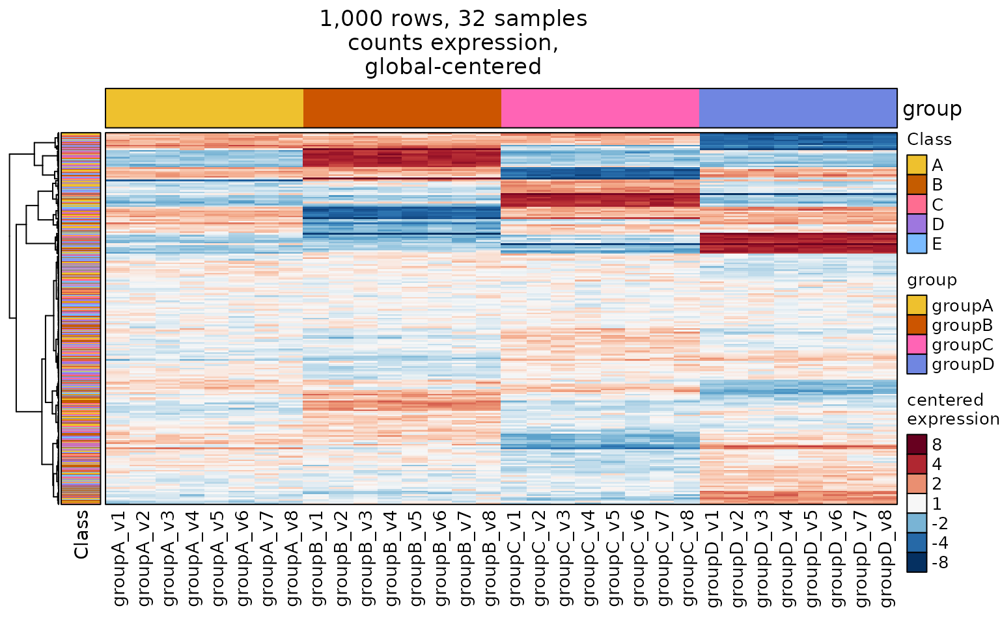

### Custom Annotation Colors

- Use `sample_color_list` to provide custom colors.
  - Provide a `list` named by the annotation column.  
  - Or use
    [`colorjam::group2colors()`](https://jmw86069.github.io/colorjam/reference/group2colors.html)
    to define categorical colors.
- `rowData_colnames` added row annotations to the left.
- `left_annotation_name_rot=60` rotated the annotation label.

``` r

sample_color_list <- list(
   group=c(
      groupA="gold",
      groupB="darkorange2",
      groupC="firebrick3",
      groupD="darkorchid4"
   ),
   Class=colorjam::group2colors(
      unique(rowData(se)$Class)))

heatmap_se(se,
   rowData_colnames="Class",
   left_annotation_name_rot=60,
   sample_color_list=sample_color_list)
#> 'magick' package is suggested to install to give better rasterization.
#> 
#> Set `ht_opt$message = FALSE` to turn off this message.
```

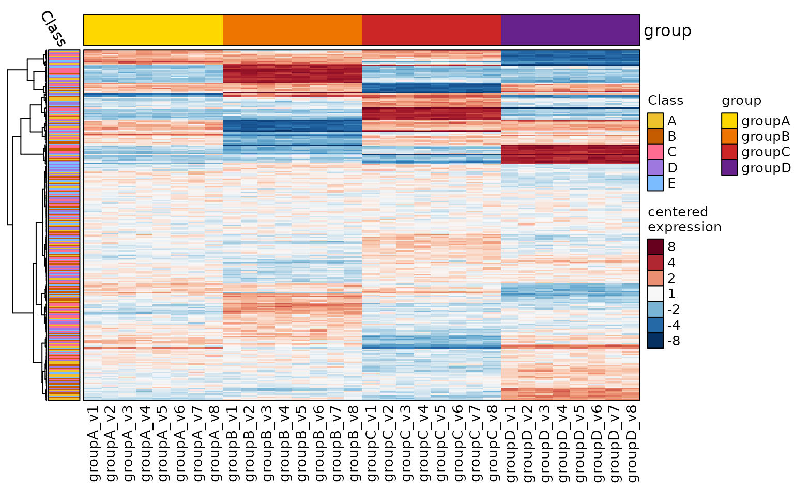

### Heatmap Legend Options

- [`ComplexHeatmap::ht_opt()`](https://rdrr.io/pkg/ComplexHeatmap/man/ht_opt.html)
  allows some stylistic options  
  to be default whenever you draw a heatmap.  
  Some common options:
  - `merge_legends=TRUE` merges the color legends to one column.
  - `ROW_ANNO_PADDING`, `COLUMN_ANNO_PADDING` defines a gap  
    between heatmap and row/column annotations, respectively.
- Also: `show_left_annotation_name="top"` places the left  
  annotation label at the top instead of the bottom.
- Also:
  [`heatmap_se()`](https://jmw86069.github.io/jamses/reference/heatmap_se.md)
  will draw the heatmap by default,  
  useful when you don’t need to store the output.  
  (I usually end up needing the heatmap.)

``` r

ComplexHeatmap::ht_opt(merge_legends=TRUE)

heatmap_se(se,
   rowData_colnames="Class",
   show_left_annotation_name="top",
   left_annotation_name_rot=150,
   sample_color_list=sample_color_list)
#> 'magick' package is suggested to install to give better rasterization.
#> 
#> Set `ht_opt$message = FALSE` to turn off this message.
```

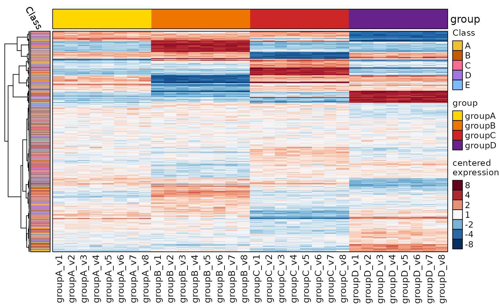

## Row and Column Groups

### Split Rows by Annotation

- `row_split="Class"` will group rows by “Class”.

``` r

hm <- heatmap_se(se,
   rowData_colnames="Class",
   row_split="Class",
   sample_color_list=sample_color_list)
#> 'magick' package is suggested to install to give better rasterization.
#> 
#> Set `ht_opt$message = FALSE` to turn off this message.

draw(hm)
```

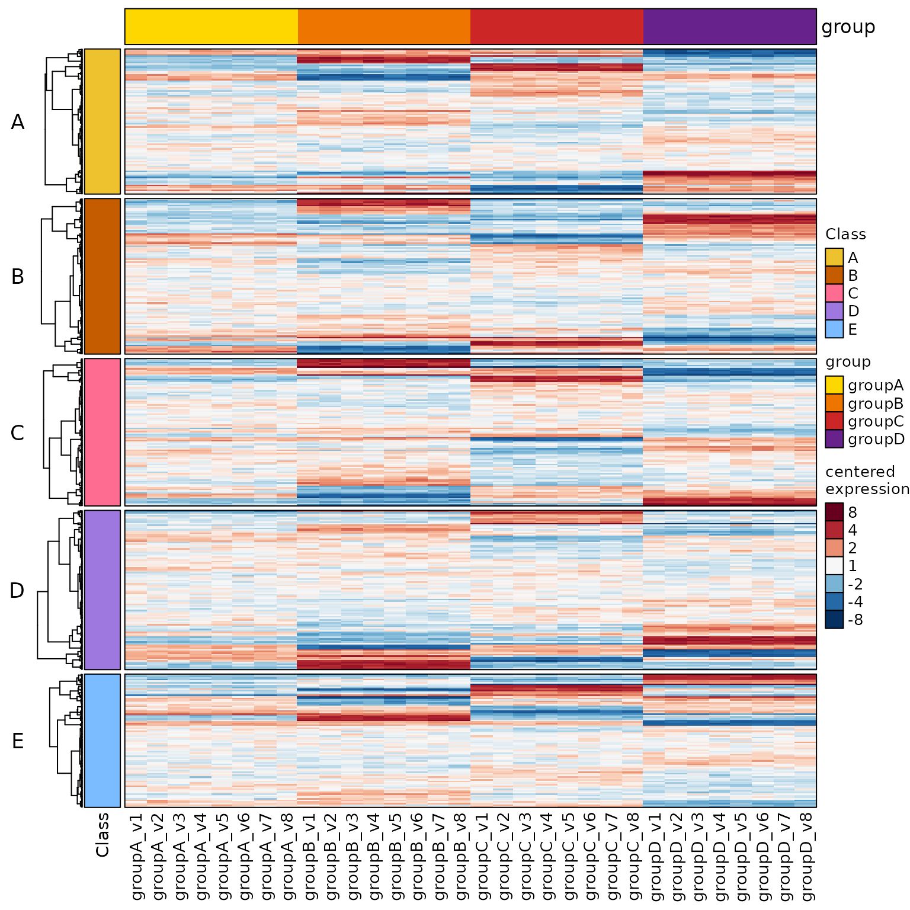

### Split Rows and Columns

- `column_split="group"` splits the columns.
- `row_split="Class"` splits the rows.
- You can provide multiple columns if needed.

``` r

hm <- heatmap_se(se,
   column_split="group",
   row_split="Class",
   rowData_colnames="Class",
   sample_color_list=sample_color_list)
#> 'magick' package is suggested to install to give better rasterization.
#> 
#> Set `ht_opt$message = FALSE` to turn off this message.

hm2 <- draw(hm)
```

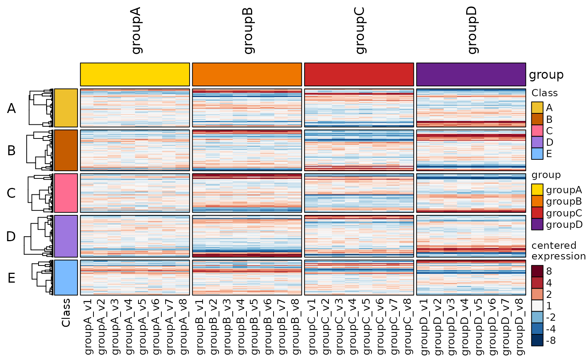

### Get the Row Group Order

- Now seems like a good time to get the row order:
  - `jamba::heatmap_row_order(hm)`
  - It returns a `list` separated by row group.
- It works best with the `hm2` drawn heatmap, since  
  some clustering methods use a random element.

``` r

hro <- jamba::heatmap_row_order(hm2);
lengths(hro)
#>   A   B   C   D   E 
#> 196 210 199 215 180
```

See the first five entries per row group:

``` r

lapply(hro, head, 5)
#> $A
#>   row_0640   row_0405   row_0417   row_0730   row_0847 
#> "row_0640" "row_0405" "row_0417" "row_0730" "row_0847" 
#> 
#> $B
#>   row_0087   row_0075   row_0421   row_0624   row_0238 
#> "row_0087" "row_0075" "row_0421" "row_0624" "row_0238" 
#> 
#> $C
#>   row_0834   row_0593   row_0670   row_0823   row_0066 
#> "row_0834" "row_0593" "row_0670" "row_0823" "row_0066" 
#> 
#> $D
#>   row_0349   row_0755   row_0633   row_0784   row_0208 
#> "row_0349" "row_0755" "row_0633" "row_0784" "row_0208" 
#> 
#> $E
#>   row_0948   row_0115   row_0874   row_0165   row_0227 
#> "row_0948" "row_0115" "row_0874" "row_0165" "row_0227"
```

### Add Grouped Column Labels

The example illustrates a two-factor design: 1. Genotype: wildtype (WT)
and knockout (KO) 2. Treatment: Control and Dexamethasone (Dex)

- Column split: `column_split=c("Genotype", "Treatment")`

- `controlSamples` uses “WT” and “Control”

- Several features are enabled:

  - `apply_hm_column_title=TRUE` displays the heatmap title.
  - `top_colnames=FALSE` hides the top annotation.
  - [`heatmap_column_group_labels()`](https://jmw86069.github.io/jamses/reference/heatmap_column_group_labels.md)
    adds grouped labels.
  - `hm_title_buffer` adds whitespace for the grouped lines.

- We add two design factors: `Genotype`, `Treatment`

``` r

colData(se)$Genotype <- rep(
   factor(c("WT", "KO"), levels=c("WT", "KO")),
   each=16);
colData(se)$Treatment <- rep(
   c("Control", "Dex"),
   each=8);

# center by groupA samples
use_controlSamples <- rownames(
   subset(colData(se),
      Genotype %in% "WT" &
      Treatment %in% "Control"))

hm9 <- heatmap_se(se,
   apply_hm_column_title=TRUE,
   hm_title_buffer=4,
   controlSamples=use_controlSamples,
   control_label="vs WT_Control",
   sestats=sestats,
   top_colnames=c("Genotype", "Treatment"),
   column_split=c("Genotype", "Treatment"),
   row_split=6,
   column_gap=grid::unit(c(1, 2, 1), "mm"),
   sample_color_list=sample_color_list)
hm9_drawn <- ComplexHeatmap::draw(hm9)

# now add fancy labels
heatmap_column_group_labels(
   hm_group_list=c("Treatment", "Genotype"),
   font_cex=1.3,
   se=se,
   hm_drawn=hm9_drawn)
```

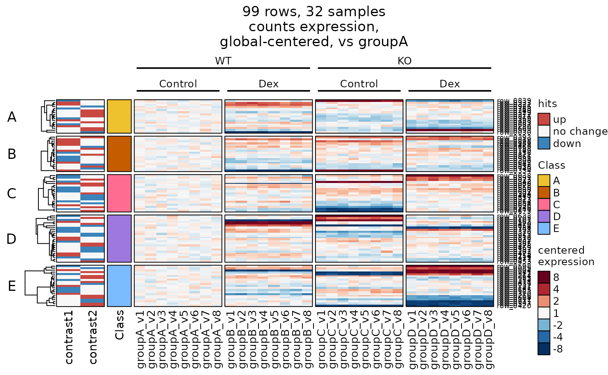

- Use `y_offset_lines` to adjust the y position of labels.

### Change Column Group Order

The example below shows the same heatmap  
grouped by: 1. Treatment 2. Genotype

``` r

hm10 <- heatmap_se(se,
   apply_hm_column_title=TRUE,
   hm_title_buffer=4,
   controlSamples=use_controlSamples,
   control_label="vs WT_Control",
   sestats=sestats,
   top_colnames=c("Treatment", "Genotype"),
   column_split=c("Treatment", "Genotype"),
   row_split=6,
   sample_color_list=sample_color_list)
hm10_drawn <- ComplexHeatmap::draw(hm10,
   merge_legends=TRUE)

# now add fancy labels
heatmap_column_group_labels(
   hm_group_list=c("Genotype", "Treatment"),
   font_cex=1.2,
   se=se,
   hm_drawn=hm10_drawn)
```

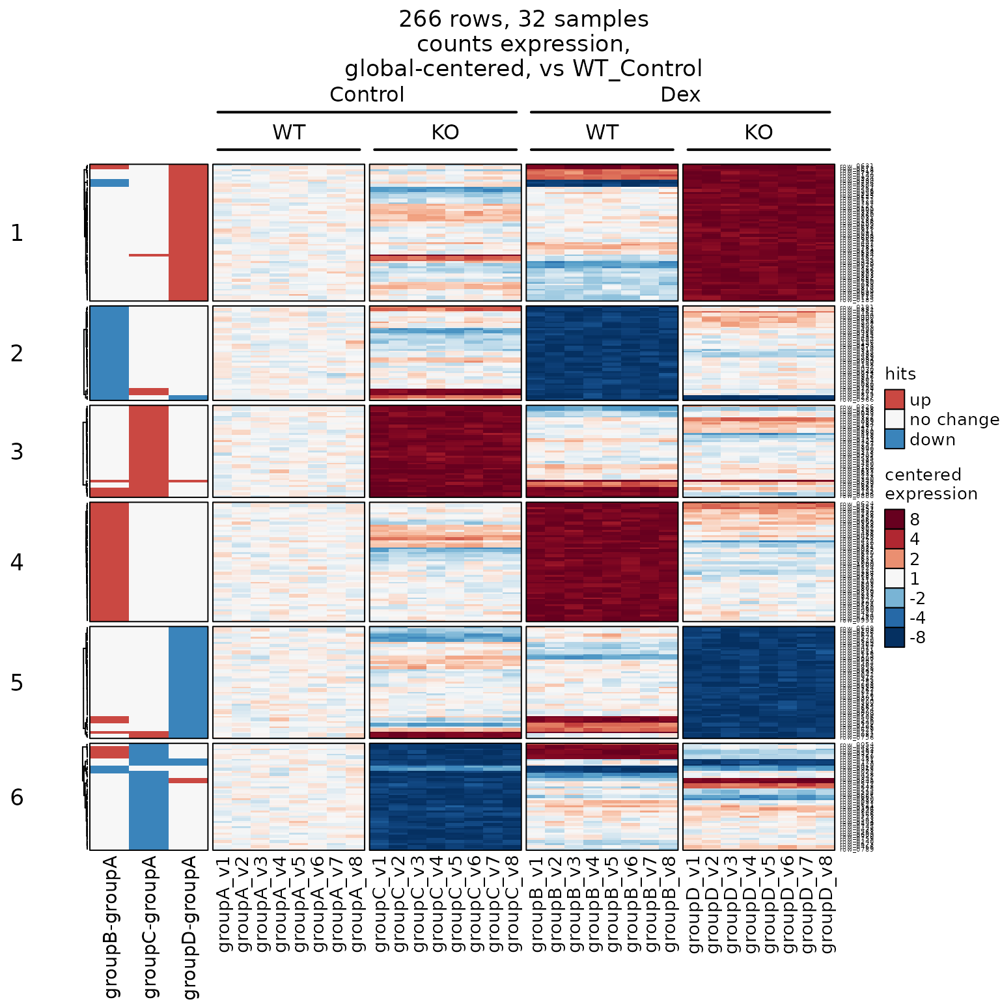

## Data Centering

- Default “data centering” subtracts the row mean value,  
  resulting in “difference from global mean”.  
  We refer to this approach as “global centering”.
- Centering typically uses the mean value (the average),  
  however it can use median with `useMedian=TRUE`.  
  The median is effective in reducing the visual effects  
  of outlier points.
- “**Versus control**”: Centering can be focused on a  
  control group, instead of global centering. This approach  
  is very effective at visualizing the data as it is seen  
  by statistical contrasts. In fact, it is encouraged.
- “**Within Groups**”: Data can be centered within  
  sub-groups, called ‘**center-by groups**’. This approach  
  is quite useful and versatile.
  1.  Consider an experiment with two different cell lines,  
      comparing treatment versus control.  
      The cell lines have substantial differences from each other,  
      however the treatment effects may be similar.  
      We would “center-by Cell Line”, then “versus Control”.
  2.  Consider an experiment with cells derived from clinical  
      patients, each patient sample is treated multiple ways.  
      Again, “center-by Patient”, then either “global center” or  
      “versus Control”.

Working examples are shown below.

### Center Using a Control Group

- `controlSamples` defines a subset of samples  
  to be the reference for data centering.
  - Here we use samples in `"groupA"`.
  - `control_label="vs GroupA"` describes the control
- `column_title_rot=90` also rotates the column group  
  title 90 degrees.
- We define a new attribute `'hm_title'` as a  
  convenient heatmap title.
  - `column_title` adds the title when we
    [`draw()`](https://rdrr.io/pkg/ComplexHeatmap/man/draw-dispatch.html)  
    the heatmap.

``` r

# center by groupA samples
use_controlSamples <- rownames(
      subset(colData(se), group %in% "groupA"))

# - control_label
hm3 <- heatmap_se(se,
   controlSamples=use_controlSamples,
   control_label="vs groupA",
   column_split="group",
   column_title_rot=90,
   row_split="Class",
   rowData_colnames="Class",
   cluster_row_slices=FALSE,
   sample_color_list=sample_color_list)

hm4 <- ComplexHeatmap::draw(hm3,
   column_title=attr(hm3, "hm_title"))
```

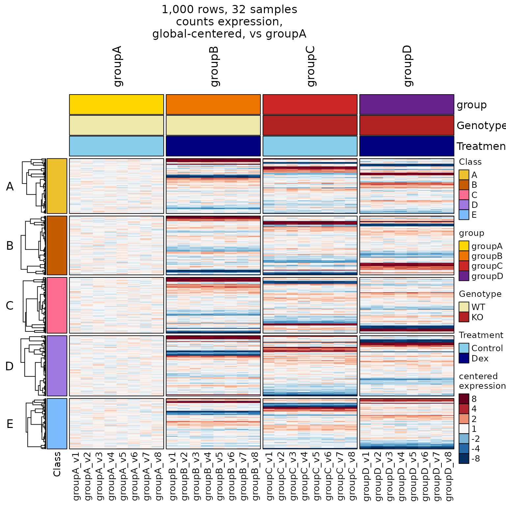

### Center By Genotype

- `centerby_colnames="Genotype"` centers within WT or KO
- `use_controlSamples_Treat` uses ‘Control’ samples  
  in both WT and KO.
  - It shows “Dex - Control” in each Genotype.
- `column_gap` adds a custom gap between column groups.

``` r

use_controlSamples_Treat <- rownames(
      subset(colData(se), Treatment %in% "Control"))

hm11 <- heatmap_se(se,
   apply_hm_column_title=TRUE,
   hm_title_buffer=3,
   controlSamples=use_controlSamples_Treat,
   control_label="vs Control",
   sestats=sestats,
   top_colnames=FALSE,
   centerby_colnames="Genotype",
   column_split=c("Genotype", "Treatment"),
   row_split=6,
   column_gap=grid::unit(c(2, 4, 2), "mm"),
   sample_color_list=sample_color_list)
hm11_drawn <- ComplexHeatmap::draw(hm11,
   merge_legends=TRUE)

# now add fancy labels
heatmap_column_group_labels(
   hm_group_list=c("Treatment", "Genotype"),
   font_cex=1.2,
   se=se,
   hm_drawn=hm11_drawn)
```

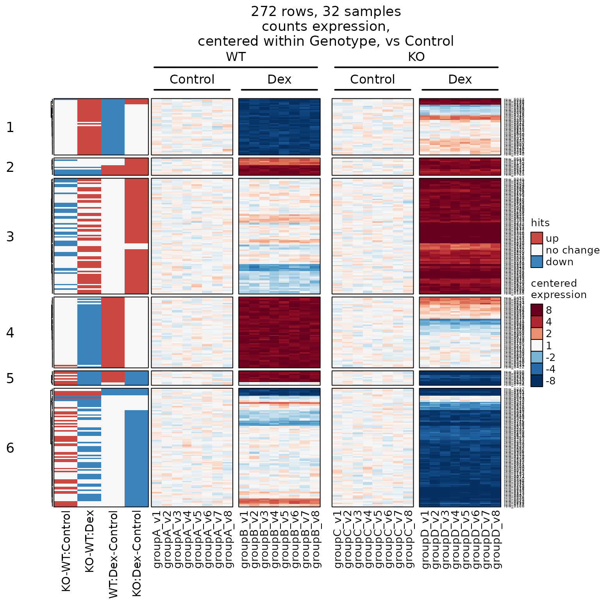

### Center by Batch

- [`simulate_se_test()`](https://jmw86069.github.io/jamses/reference/simulate_se_test.md)
  - Simulates test data that contains a blocking effect.  
    It also represents pairing factors (repeated measures), or batch
    effect.
  - When simulating four groups (default),  
    it simulates two-factor additive changes.
- `centerby_colnames="batch"` \> **Important Note:** This technique is
  entirely visual,  
  although it helps confirm potential structure within the data.  
  The math very closely mimics the adjustment performed in most  
  statistical tools, however we recommend using the proper  
  statistical adjustments, specifically `block` in limma, or  
  using an additional factor in DESeq2 or edgeR. It is generally  
  not recommended to perform statistical testing with  
  batch-adjusted data.

#### Without Batch-Centering

``` r

seb <- simulate_se_test(ngroups=4, nreps=8, multiplier=2)
#> Warning in rep(c("Ctl", "Dex"), each = nreps * 2): first element used of 'each'
#> argument
#> Warning in rep(c("WT", "KO"), each = nreps): first element used of 'each'
#> argument
#> Warning in matrix(ncol = ngroups, nrow = nrow(m), data = c(rep(0, nrow(m)), :
#> data length [1249] is not a sub-multiple or multiple of the number of rows
#> [250]
#> Warning in seq_len(nreps): first element used of 'length.out' argument
#> Warning in seq_len(nreps): first element used of 'length.out' argument
#> Warning in seq_len(nreps): first element used of 'length.out' argument
#> Warning in seq_len(nreps): first element used of 'length.out' argument
colData(seb)[, 2:3] <- colData(se)[, 3:4]
colnames(colData(seb))[2:3] <- colnames(colData(se))[3:4]

hm11 <- heatmap_se(
   seb,
   column_title="Global Centering",
   top_colnames=c("Genotype", "Treatment", "batch"),
   column_split=c("Genotype", "Treatment"),
   row_split=6,
   column_gap=grid::unit(c(2, 4, 2), "mm"),
   sample_color_list=sample_color_list)
hm11_drawn <- ComplexHeatmap::draw(hm11)
```

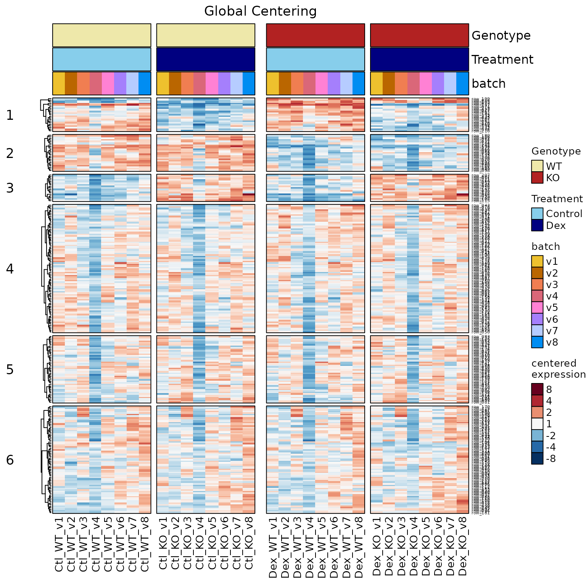

#### Center within batch

``` r

hm12 <- heatmap_se(
   seb,
   column_title="Within-Batch Centering",
   top_colnames=c("Genotype", "Treatment", "batch"),
   column_split=c("Genotype", "Treatment"),
   centerby_colnames="batch",
   row_split=6,
   column_gap=grid::unit(c(2, 4, 2), "mm"),
   sample_color_list=sample_color_list)
hm12_drawn <- ComplexHeatmap::draw(hm12)
```

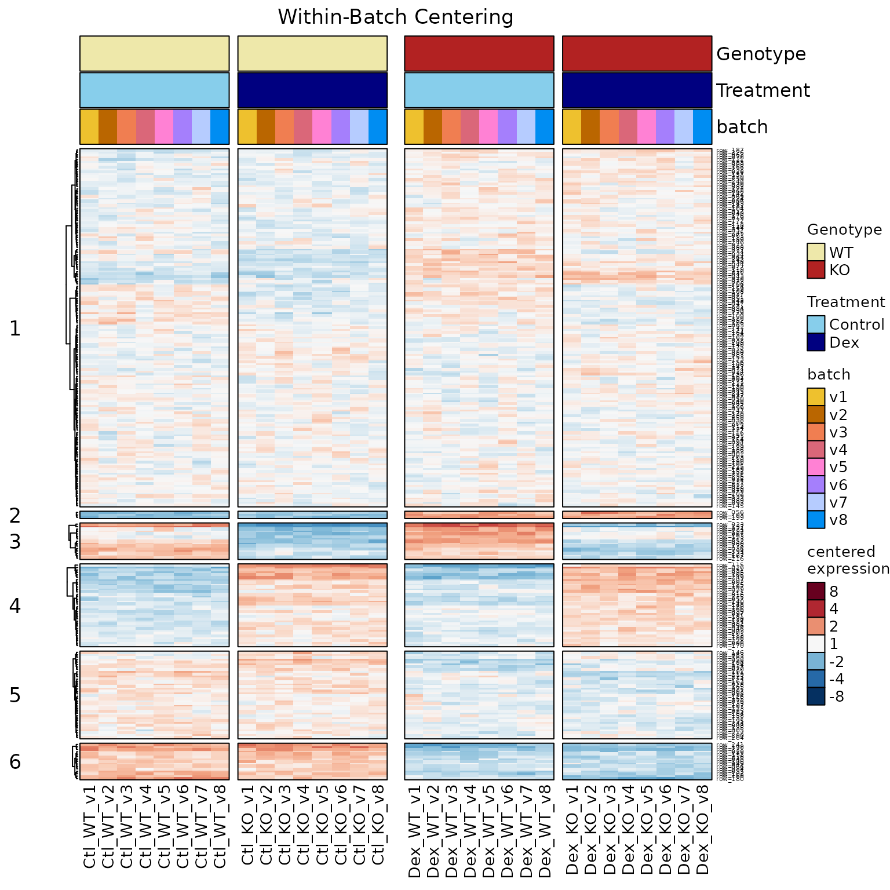

#### Compare Two Heatmaps

- [`ComplexHeatmap::Heatmap`](https://rdrr.io/pkg/ComplexHeatmap/man/Heatmap.html)
  objects can be `+` added  
  together to display both heatmaps side-by-side.
- \*\*It requires both heatmaps to have identical rows.
  - It does not require the heatmaps to have identical clustering, row
    split.
- `ht_gap` uses [`grid::unit()`](https://rdrr.io/r/grid/unit.html) to
  define a 3-cm  
  gap between heatmaps.

``` r

ComplexHeatmap::draw(
   hm11 + hm12,
   column_title="Comparing Two Data Centering Approaches",
   column_title_gp=grid::gpar(fontsize=20),
   ht_gap=grid::unit(3, "cm")
)
#> Warning: Heatmap/annotation names are duplicated: centered expression
```

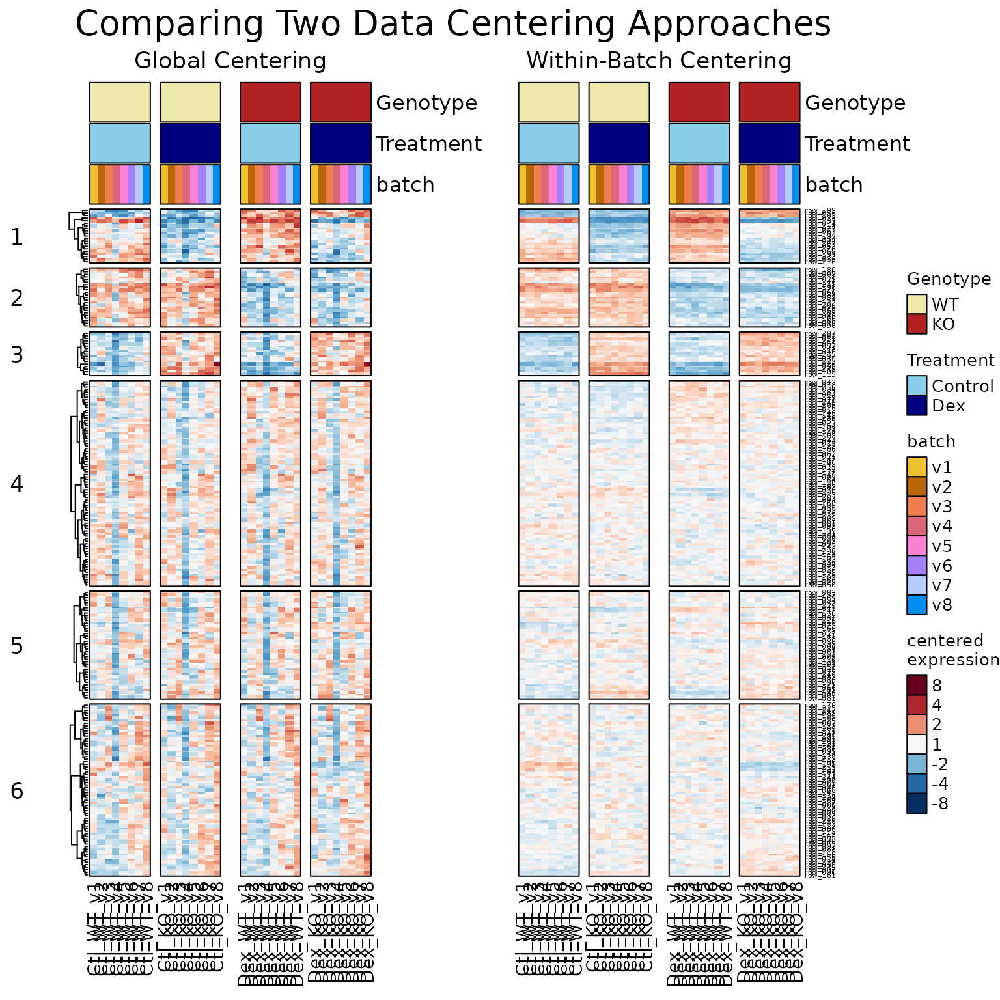

## Statistical Hits

### Display Statistical Hits

- `sestats` enables statistical hits on the left side.
- It can be a `list` named by contrast, each with:
  - a `numeric` vector named by `gene` rownames.
  - values should be `-1` down, or `+1` up.
  - Any non-zero value is considered a ‘hit’.
- It can be an incidence matrix.
  - `rownames` should match some heatmap `rownames`.
  - `colnames` should be contrast names
  - values are `numeric`, where `-1` is down, `+1` is up.
- It can be `SEStats` from
  [`se_contrast_stats()`](https://jmw86069.github.io/jamses/reference/se_contrast_stats.md).
  - This step is outside the scope, but is convenient!
  - See [Run Limma Statistics](#Run%20Limma%20Statistics) for an
    example.

We create a `list` of hit vectors:

``` r

# define a random set of hits
sestats_list <- list(
   contrast1=setNames(
      sample(c(1, -1), replace=TRUE, size=50),
      sample(rownames(se), size=50)
   ),
   contrast2=setNames(
      sample(c(1, -1), replace=TRUE, size=50),
      sample(rownames(se), size=50)
   )
)
```

- Now create the heatmap with `sestats`:

``` r

hm6 <- heatmap_se(se,
   controlSamples=use_controlSamples,
   control_label="vs groupA",
   sestats=sestats_list,
   column_split="group",
   row_split="Class",
   rowData_colnames="Class",
   sample_color_list=sample_color_list)

ComplexHeatmap::draw(hm6,
   column_title=attr(hm6, "hm_title"))
```

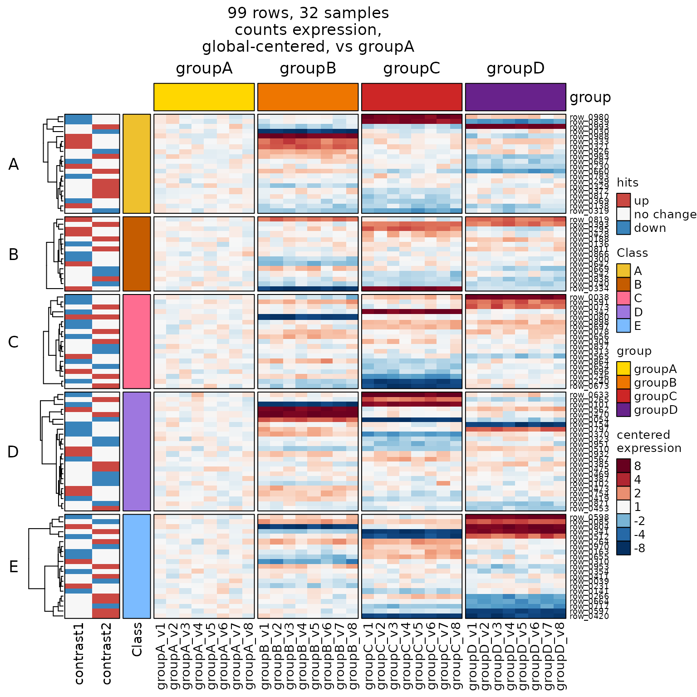

### Run Limma Statistics

- [`se_contrast_stats()`](https://jmw86069.github.io/jamses/reference/se_contrast_stats.md)
  automates `limma` for multiple contrasts.
  - It applies `lmFit()`, `fitContrasts()`, `topTable()`,  
    even `voom()` or `DEqMS` as appropriate.
  - It analyzes each contrast and assay.
  - It returns `SEStats`, used directly in the heatmap

``` r

# SEDesign
sedesign <- groups_to_sedesign(
   colData(se)[, "group", drop=FALSE])
# use only "versus groupA"
contrast_names(sedesign) <- jamba::vigrep("-groupA", contrast_names(sedesign))

# run stats
sestats <- se_contrast_stats(
   se=se,
   fold_cutoff=4,
   sedesign=sedesign,
   assay_name="counts")
```

- Use `SEStats` with
  [`heatmap_se()`](https://jmw86069.github.io/jamses/reference/heatmap_se.md):

``` r

hm6s <- heatmap_se(se,
   controlSamples=use_controlSamples,
   control_label="vs groupA",
   sestats=sestats,
   column_split="group",
   row_split=6,
   rowData_colnames="Class",
   sample_color_list=sample_color_list)

ComplexHeatmap::draw(hm6s,
   column_title=attr(hm6s, "hm_title"))
```

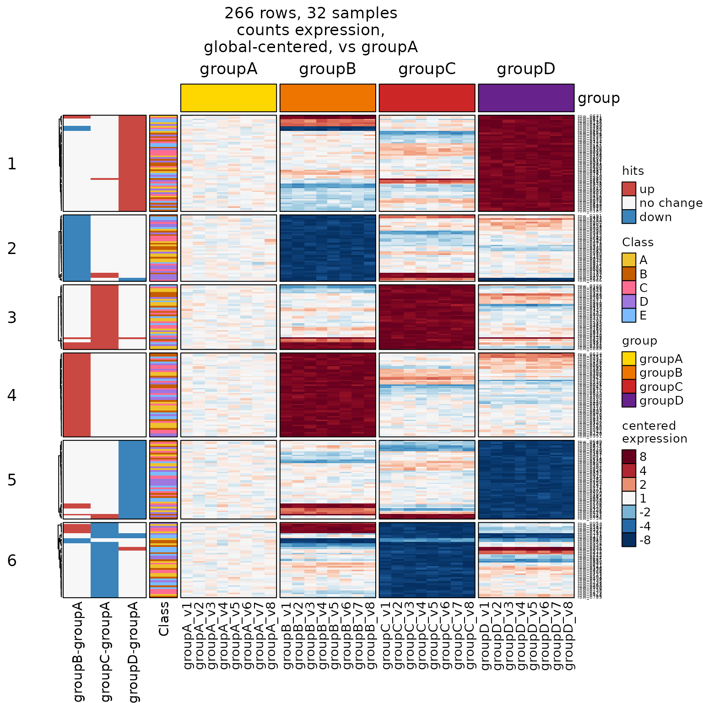

### Drill Down by Row Cluster

- `row_subcluster="4"` makes it easy to answer  
  “What is going on with Cluster 4?”

``` r

# for fun, "drill down" into cluster 5
hm6s_4 <- heatmap_se(se,
   controlSamples=use_controlSamples,
   control_label="vs groupA",
   sestats=sestats,
   column_split="group",
   row_split=6,
   row_subcluster=4,
   rowData_colnames="Class",
   sample_color_list=sample_color_list)
#> Warning: The heatmap has not been initialized. You might have different results
#> if you repeatedly execute this function, e.g. when row_km/column_km was
#> set. It is more suggested to do as `ht = draw(ht); row_order(ht)`.

ComplexHeatmap::draw(hm6s_4,
   column_title=attr(hm6s_4, "hm_title"))
```

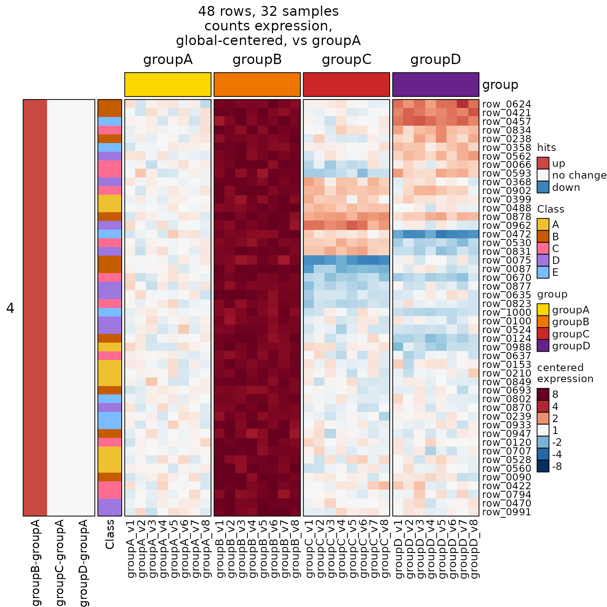

### Use a Hit Incidence Matrix

- What is an incidence matrix, you wonder?
  - We demonstrate the data format below.
  - Rows are genes from `rownames(se)`.
  - Columns are contrasts, comparisons, or any useful label.
  - Any non-zero value is considered a hit,  
    and it colorized by direction.

``` r

# convert sestats to list, then incidence matrix
sestats_hitlist <- hit_array_to_list(sestats)
sestats_hitim <- venndir::list2im_value(sestats_hitlist[1:2])
print(head(sestats_hitim));
#>          groupB-groupA groupC-groupA
#> row_0022            -1            -1
#> row_0030            -1             0
#> row_0066             1             0
#> row_0075             1             0
#> row_0080            -1             0
#> row_0087             1             0
```

- Now `sestats_hitim` defines statistical hits.

``` r

hm7 <- heatmap_se(se,
   controlSamples=use_controlSamples,
   control_label="vs groupA",
   sestats=sestats_hitim,
   column_split="group",
   rowData_colnames="Class",
   sample_color_list=sample_color_list)

ComplexHeatmap::draw(hm7,
   column_title=attr(hm7, "hm_title"))
```

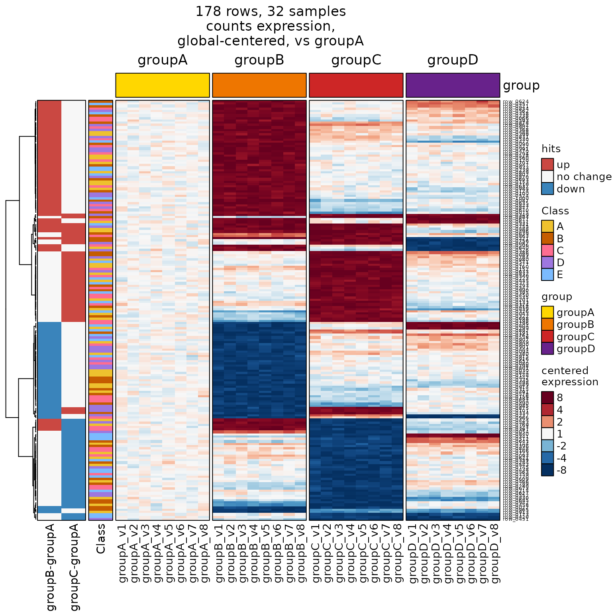

## Correlation Heatmaps

Any standard
[`heatmap_se()`](https://jmw86069.github.io/jamses/reference/heatmap_se.md)
can be converted to a  
correlation heatmap by adding:  
`correlation=TRUE`

- It uses the centered data that would have been displayed  
  in the heatmap, and instead calls
  [`cor()`](https://rdrr.io/r/stats/cor.html) to create Pearson  
  correlation `matrix`.
  - You can review the data used for correlation using:  
    `hm <- heatmap_se(se)`  
    then:  
    `hm@matrix`
  - Correlation uses `use="pairwise.complete.obs"` and `...`  
    ellipses can be used for custom `method`.
- The heatmap defaults are changed:
  - `max_color=1` so the color range becomes `-1 to +1`
  - `row_split` and `row_label_colname` refer to `colData(se)`.
  - `legend_labels` use `legend_at` directly, no fold conversion.
  - `cluster_columns` controls rows and columns, for symmetry.
  - The default legend title adds `'correlation of'`.

``` r

hm8corr <- heatmap_se(seb,
   correlation=TRUE,
   apply_hm_column_title=TRUE,
   # controlSamples=use_controlSamples,
   cluster_columns=FALSE,
   sample_color_list=sample_color_list)

ComplexHeatmap::draw(hm8corr)
```

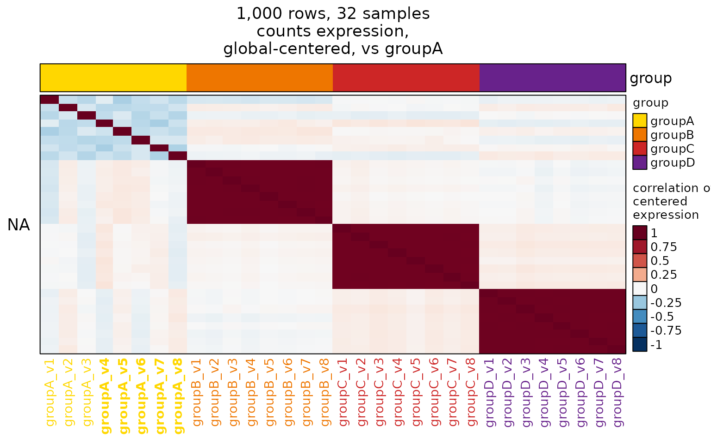

> Hint: This correlation heatmap shows what we expect  
> when there is a sample pairing or batch effect.  
> The key feature is “positive correlation along a diagonal.”

- You can adjust for pairing factor using  
  `centerby_colnames="batch"`:

``` r

hm8corr_batch <- heatmap_se(seb,
   correlation=TRUE,
   centerby_colnames="batch",
   apply_hm_column_title=TRUE,
   cluster_columns=FALSE,
   sample_color_list=sample_color_list)

ComplexHeatmap::draw(hm8corr_batch)
```

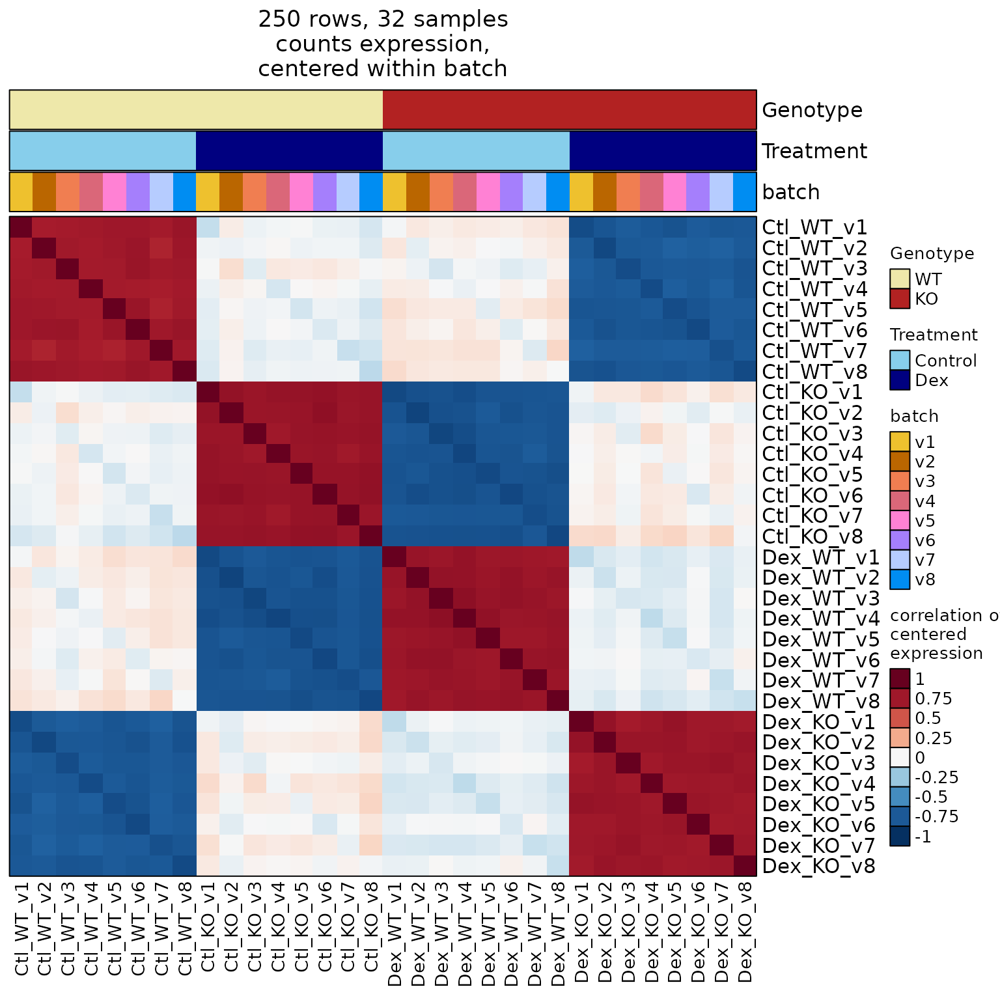

> Incidentally, the very small negative correlation along  
> the diagonal is also indicative of simple batch adjustment.  
> The common signal is removed across replicates in the same  
> batch, which by definition leaves only slight differences.  
> As a result, the residual is typically slightly negative.

> Notice also that the overall group correlations have  
> increased substantially, due to the reduction in non-group  
> correlated signal. This increase is another indication that  
> the batch/pairing effect was appropriately modeled.

## Custom Visual Options

### Add Callout Labels for Some Rows

- `mark_rows` adds labels to the right
  - Great for labeling genes of interest, especially  
    when there are too many rows in the heatmap.
  - We add 5 labels from ‘A’, and 3 labels from ‘D’.
- In RStudio, you may want to silence some warnings:  
  `ComplexHeatmap::ht_opt(message=FALSE)`

``` r

# add "callout" labels for a subset of rows
hro <- jamba::heatmap_row_order(hm4);
mark_rows <- c(
   sample(hro[["A"]], size=5),
   sample(hro[["D"]], size=3));

hm5 <- heatmap_se(se,
   mark_rows=mark_rows,
   controlSamples=use_controlSamples,
   control_label="vs groupA",
   column_split="group",
   column_title_rot=90,
   row_split="Class",
   rowData_colnames="Class",
   sample_color_list=sample_color_list)

ComplexHeatmap::draw(hm5,
   column_title=attr(hm5, "hm_title"))
```

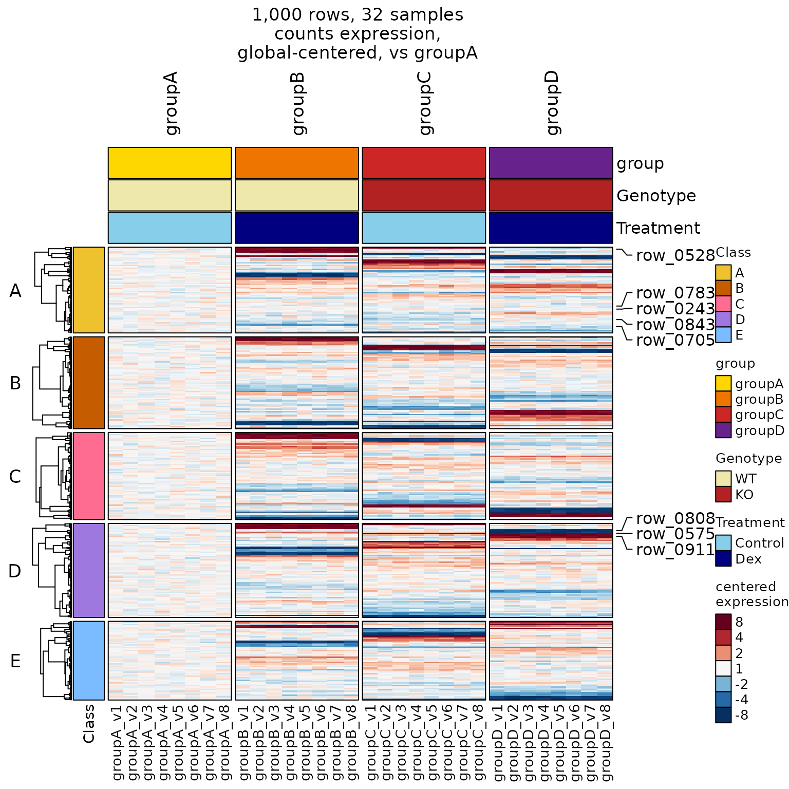

### Customize Column Labels

- Many labels options can be customized: size, color, fontface
  - This example shows how to change the color  
    using `column_names_gp`, which uses
    [`grid::gpar()`](https://rdrr.io/r/grid/gpar.html).

``` r

# customize column label fonts using column_names_gp
column_bold <- ifelse(
   SummarizedExperiment::colData(se)$group %in% "groupA",
   2, 1);
column_colors <- sample_color_list$group[
   as.character(SummarizedExperiment::colData(se)$group)
]

hm8 <- heatmap_se(se,
   controlSamples=use_controlSamples,
   control_label="vs groupA",
   column_names_gp=grid::gpar(
      col=column_colors,
      font=column_bold
   ),
   column_split="group",
   row_split="Class",
   rowData_colnames="Class",
   sample_color_list=sample_color_list)

ComplexHeatmap::draw(hm8,
   column_title=attr(hm8, "hm_title"))
```

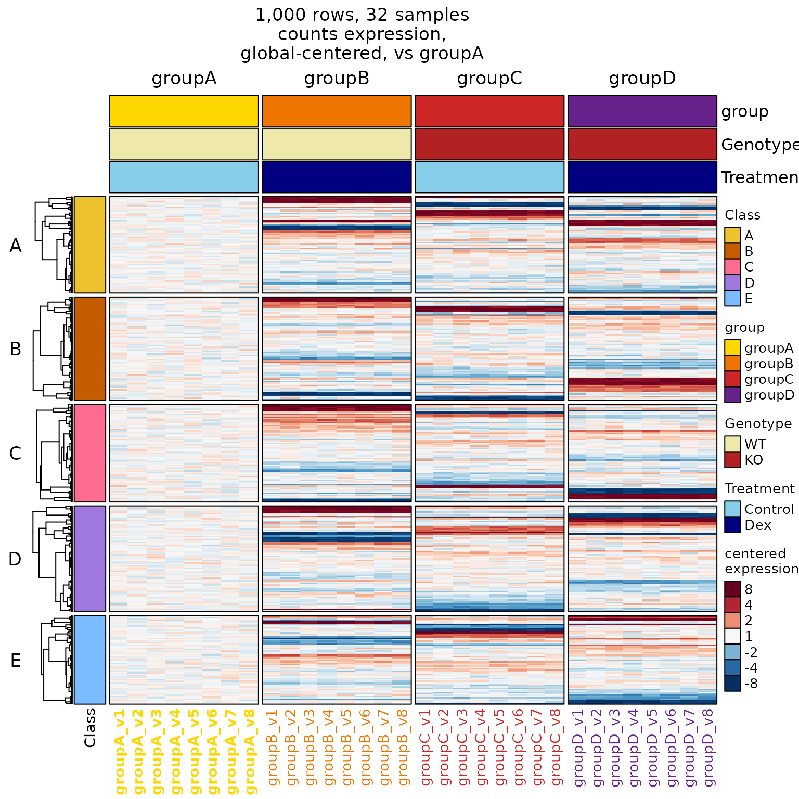

### Create a Correlation Heatmap

- Just add `correlation=TRUE`.
  - Any heatmap becomes a correlation heatmap,  
    using the same centered data as displayed  
    in the normal heatmap.
  - Centered data are used with
    [`cor()`](https://rdrr.io/r/stats/cor.html), which is  
    the recommended way to calculate correlation values.  
  - It answers “What correlates using difference-from-average?”
- `cluster_columns=TRUE` enables column clustering.
- Remove `column_split` to allow unsupervised clustering.

``` r

# correlation=TRUE, any heatmap becomes a sample correlation heatmap
hm8corr <- heatmap_se(se,
   correlation=TRUE,
   apply_hm_column_title=TRUE,
   controlSamples=use_controlSamples,
   control_label="vs groupA",
   column_names_gp=grid::gpar(
      col=column_colors,
      font=column_bold),
   cluster_columns=TRUE,
   sample_color_list=sample_color_list)

ComplexHeatmap::draw(hm8corr)
```

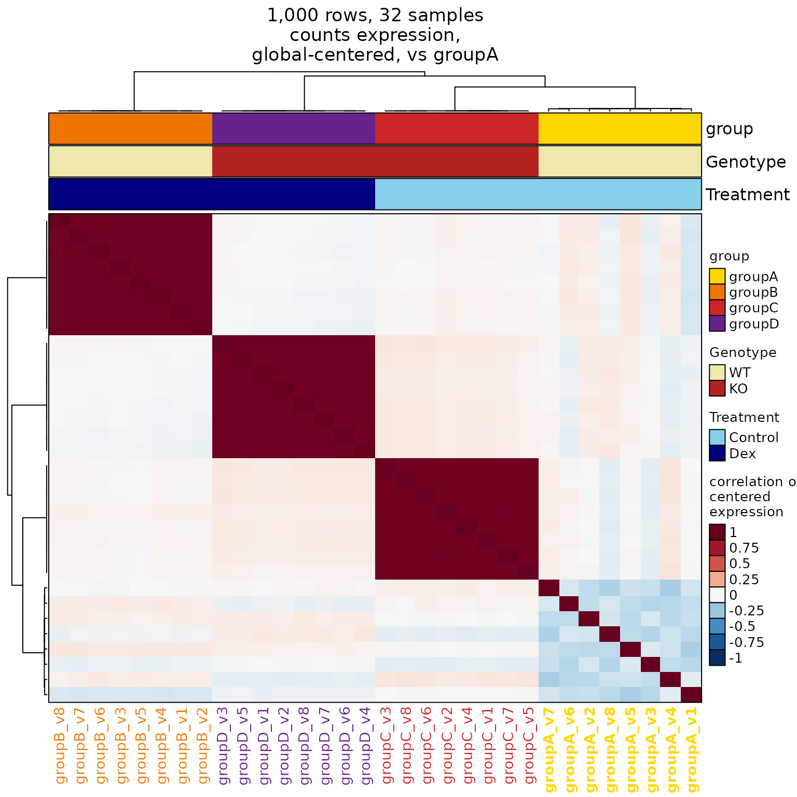
