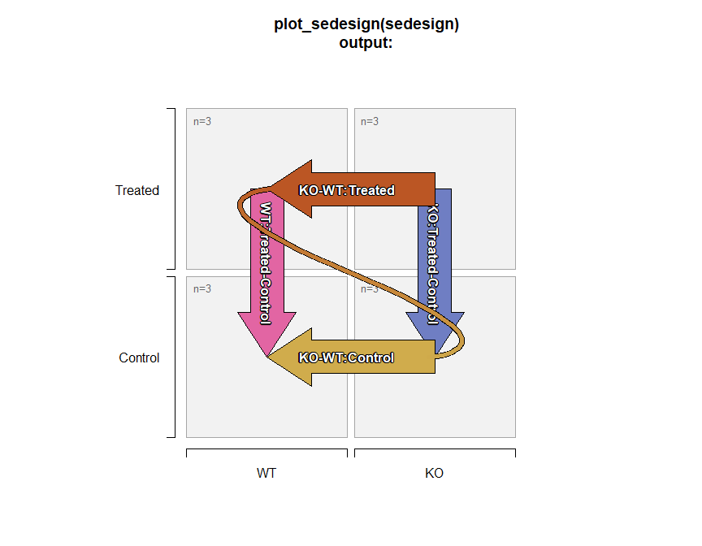

# Jam SummarizedExperiment Stats (jamses)

This package is under active development. These functions are in
frequent use in active Omics analysis projects. A summary of goals and
relevant features are described below.

[Jamses Online Documentation](https://jmw86069.github.io/jamses)

## Goals of jamses

The core goal is to make data analysis and visualization of
`SummarizedExperiment` objects straightforward for common scenarios. It
also accepts `SingleCellExperiment` and `Seurat` objects.

- **[Make Effective
  Heatmaps](https://jmw86069.github.io/jamses/articles/how_to_heatmap.html)**

- **Apply Normalization / Adjustment**

- `SEDesign`: **Create Design and Contrast matrices**

  - Use `~ 0 + group` syntax, see below.
  - Integrate Samples, Groups, and Contrasts.
  - Visualize with
    [`plot_sedesign()`](https://jmw86069.github.io/jamses/reference/plot_sedesign.md).

- `SEStats`: **Analyze Multiple Contrasts**

  - Use limma / limma-voom / limma-DEqMS.

- **Convenient contrast labels**

  ``` R
   Contrast:
   `(Knockout_treated-Knockout_control)-(Wildtype_treated-Wildtype_control)`

   Comp:
   `Knockout-Wildtype:treated-control`
  ```

- **Integrate with other tools**.

  - `SummarizedExperiment`, `SingleCellExperiment`, `Seurat`,
    `ExpressionSet`, `DESeqDataset`, `DGElist`
  - [`venndir::venndir()`](https://jmw86069.github.io/venndir/reference/venndir.html) -
    see Github `"jmw86069/venndir"` to create directional Venn diagrams.

## Make Effective Heatmaps

[How to Make a
Heatmap](https://jmw86069.github.io/jamses/articles/how_to_heatmap.html)

Jamses
[`heatmap_se()`](https://jmw86069.github.io/jamses/reference/heatmap_se.md)
reinforces heatmap principles, and applies some opinions.

- Data are centered.
- Always use divergent colors for centered data.
- Data are **not scaled**.
- Row and Column annotations are “easy”.

## Approach for Statistical Contrasts

[The Limma User’s
Guide](https://www.bioconductor.org/packages/devel/bioc/vignettes/limma/inst/doc/)
(LUG) is an amazing resource which describes numerous approaches for
one-way and two-way contrasts **which are mathematically equivalent**.
For a more thorough discussion please review these approaches to confirm
that `~0 + x` is mathematically identical to `~ x`, and only differs in
how estimates are reported.

- Jamses uses the `~0 + x` strategy.

- Each experiment group is defined using independent replicates.  

- This approach *does not imply* that there is “no intercept” during the
  model fit, see LUG for details.

- One-way contrasts compare only one factor per contrast.

  - Valid one-way contrast:

  ``` R
  (A_treated - A_control) # valid one-way contrast
  ```

  - Invalid one-way contrast:

  ``` R
  (A_treated - B_control) # not a valid one-way contrast
  ```

- Two-way contrasts in Jamses compare the fold change of two
  ***compatible*** one-way fold changes.

  - Two compatible one-way contrasts:

  ``` R
  (A_treated - A_control)  # one-way contrast
                           # "treated-control" for A
  (B_treated - B_control)  # compatible one-way contrast
                           # "treated-control" for B
  ```

  - Corresponding two-way contrast:

  ``` R
  (B_treated - B_knockout) # incompatible one-way contrast
  ```

## SEDesign: Design and Contrasts

- [`groups_to_sedesign()`](https://jmw86069.github.io/jamses/reference/groups_to_sedesign.md)
  takes by default a `data.frame` where each column represents an
  experiment factor, and creates the following:
- Output is `SEDesign` as an S4 object with slot names:
  - `design(sedesign)` - the design matrix.
  - `contrasts(sedesign)` - the contrasts matrix.
  - `samples(sedesign)` - vector of samples.

### Example SEDesign object

The example below uses a `character` vector of group names per sample,
with two factors separated by underscore `"_"`. The same data can be
provided as a `data.frame` with two columns.

``` r

library(jamses)
library(kableExtra)

igroups <- jamba::nameVector(paste(rep(c("WT", "KO"), each=6),
   rep(c("Control", "Treated"), each=3),
   sep="_"),
   suffix="_rep");
igroups <- factor(igroups, levels=unique(igroups));
# jamba::kable_coloring(color_cells=FALSE,
#    format="markdown",
#    caption="Sample to group association",
#    data.frame(groups=igroups))
knitr::kable(data.frame(groups=igroups))
```

|                 | groups     |
|:----------------|:-----------|
| WT_Control_rep1 | WT_Control |
| WT_Control_rep2 | WT_Control |
| WT_Control_rep3 | WT_Control |
| WT_Treated_rep1 | WT_Treated |
| WT_Treated_rep2 | WT_Treated |
| WT_Treated_rep3 | WT_Treated |
| KO_Control_rep1 | KO_Control |
| KO_Control_rep2 | KO_Control |
| KO_Control_rep3 | KO_Control |
| KO_Treated_rep1 | KO_Treated |
| KO_Treated_rep2 | KO_Treated |
| KO_Treated_rep3 | KO_Treated |

The resulting design and contrasts matrices are shown below:

``` r

sedesign <- groups_to_sedesign(igroups);
jamba::kable_coloring(
# knitr::kable(
   colorSub=c(`-1`="dodgerblue", `1`="firebrick"),
   caption="Design matrix output from design(sedesign).",
   data.frame(check.names=FALSE, design(sedesign)));
```

|                 | WT_Control | WT_Treated | KO_Control | KO_Treated |
|:----------------|-----------:|-----------:|-----------:|-----------:|
| WT_Control_rep1 |          1 |          0 |          0 |          0 |
| WT_Control_rep2 |          1 |          0 |          0 |          0 |
| WT_Control_rep3 |          1 |          0 |          0 |          0 |
| WT_Treated_rep1 |          0 |          1 |          0 |          0 |
| WT_Treated_rep2 |          0 |          1 |          0 |          0 |
| WT_Treated_rep3 |          0 |          1 |          0 |          0 |
| KO_Control_rep1 |          0 |          0 |          1 |          0 |
| KO_Control_rep2 |          0 |          0 |          1 |          0 |
| KO_Control_rep3 |          0 |          0 |          1 |          0 |
| KO_Treated_rep1 |          0 |          0 |          0 |          1 |
| KO_Treated_rep2 |          0 |          0 |          0 |          1 |
| KO_Treated_rep3 |          0 |          0 |          0 |          1 |

Design matrix output from design(sedesign). {.table .table
style="margin-left: auto; margin-right: auto;"}

``` r


# knitr::kable(
jamba::kable_coloring(
   colorSub=c(`-1`="dodgerblue", `1`="firebrick"),
   caption="Contrast matrix output from contrasts(sedesign).",
   data.frame(check.names=FALSE, contrasts(sedesign)));
```

|  | KO_Control-WT_Control | KO_Treated-WT_Treated | WT_Treated-WT_Control | KO_Treated-KO_Control | (KO_Treated-WT_Treated)-(KO_Control-WT_Control) |
|:---|---:|---:|---:|---:|---:|
| WT_Control | -1 | 0 | -1 | 0 | 1 |
| WT_Treated | 0 | -1 | 1 | 0 | -1 |
| KO_Control | 1 | 0 | 0 | -1 | -1 |
| KO_Treated | 0 | 1 | 0 | 1 | 1 |

Contrast matrix output from contrasts(sedesign). {.table .table
style="margin-left: auto; margin-right: auto;"}

For convenience, SEDesign can be visualized using
[`plot_sedesign()`](https://jmw86069.github.io/jamses/reference/plot_sedesign.md):

``` r

# plot the design and contrasts
plot_sedesign(sedesign);
title(main="plot_sedesign(sedesign)\noutput:")
```



- Two-way contrasts are indicated by the “squiggly curved line” which
  connects the end of one contrast to the beginning of the next
  contrast. This connection describes the first contrast, subtracted by
  the second contrast.

## Future work:

- Enable equivalent analyses using `DESeq2`, `edgeR` methodology.
